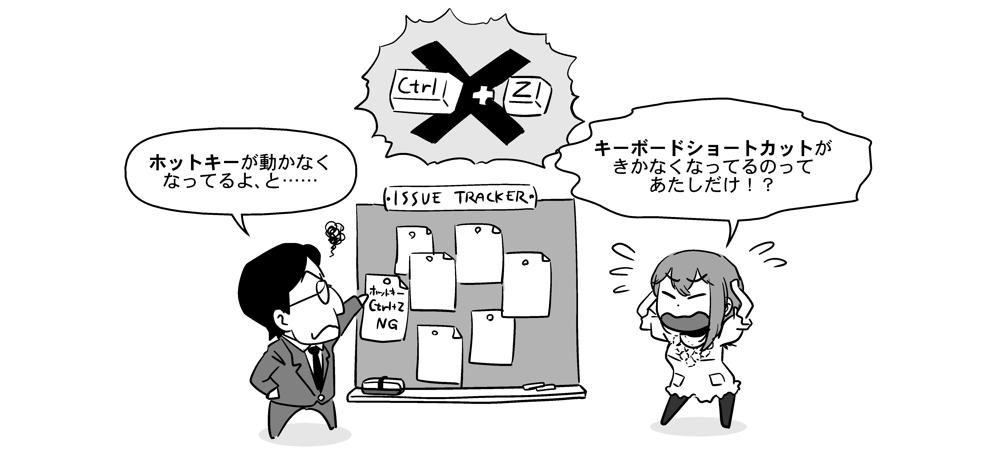
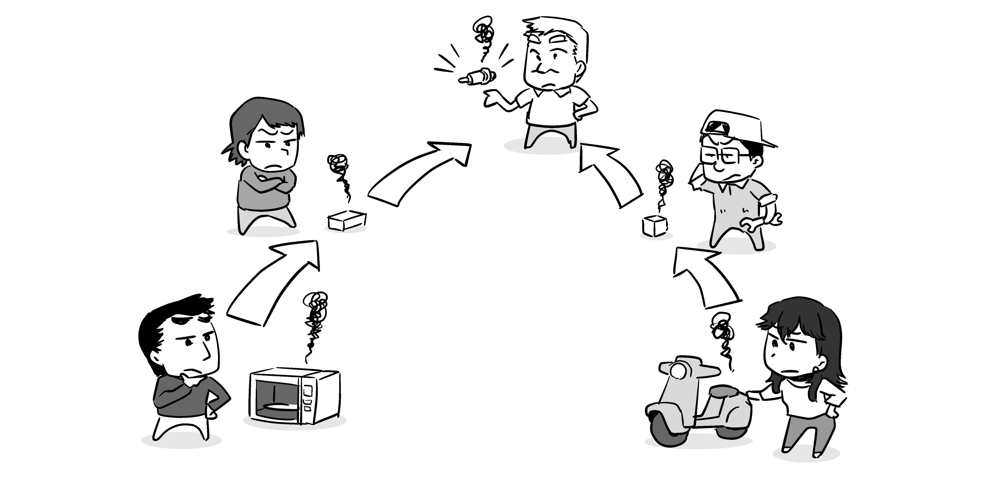

# それでもためらってしまうあなたへ

ここまで、OSSへのフィードバックの仕方について色々と解説してきました。しかしどれだけ準備しても、いざ報告しようとするとやっぱり足がすくんでしまう、という人は少なくないようです。

OSS Gateワークショップでは、ビギナーの方がそんなふうにためらっていたら、「いいからYouやっちゃいなよ！」と（無責任に）背中を押してしまうことが多いです。大抵の場合は杞憂ですし、杞憂でない場合でも、そういう「しくじり」は大抵のコントリビューターが一度は、もしかしたら何度となく、やらかしているものです。また、あなたが「しくじり」と恐れているそれは、ひょっとすると*避けるべきしくじりではなく、有益な何かかもしれません*。

## 重複する報告、していいんです

フィードバックをためらう場合で一番多いのは、*「すでに他の人が報告しているにもかかわらず、自分の探し方が下手なだけで、既存の報告を見つけられていないだけかもしれない」と不安に感じる*場合でしょう。

そのように心配するということは、*もう自分に思いつく限りのキーワードで一通り検索したあと*なのではないでしょうか？

もしそうなら、*あなたの言葉で*新しい報告としてフィードバックしていいです。なぜなら、同じ一つの原因から起こる問題でも、遭遇した場面や発生時の状況、報告する人の主観によって、報告の表現の仕方はそれぞれ変わってくるからです。

同じ原因の問題に関する報告がすでになされていた場合、どちらか（基本的には後からフィードバックされた方）に「こちらの別の報告と重複する報告である」という印が付けられと、主にその問題についての議論が行われている報告へと誘導するような情報がプロジェクト運営者によって付けられます。

でも、そんな場合でも、「あぁ、自分の探し方が悪かったせいで見つけられなかったんだ。恥ずかしい。プロジェクトのリソースを無駄にさせてしまった……」なんて凹み方をする必要はありません。何故なら、あなたがした報告自体が、*今後同じ探し方をする人のための誘導になる*からです。

<!-- 誘導になった事例をイラストにする -->

また、根本的な原因についてはすでに報告があったとしても、その報告で触れられている以外の現象の情報があると、それは*その問題の影響度合いを示す追加の情報*になります。当初の報告の時点では「些細な問題だから後回しにしようと」判断されていた物が、実はユーザーレベルで大きな影響を受ける物だったと分かって、対応の重要度・緊急度が引き上げられる、ということは珍しくありません。

ただし、*「すでに似たような報告がなされていないか、自分の言葉で既存の報告を探す」という一手間を惜しんで、何も探さないままで新たに報告する、というのはマナー違反です*。そのような「新しい情報がまったく無い重複した報告」には何の意義もなく、結局は、プロジェクト運営者のやる気を地味に削るだけになってしまうからです。あなたが心配しているのは、自分の報告がそういうケースに該当してしまっていないかということでしょう。

筆者の場合、「自分に思いつく限りの表現で既存の報告を探してみて、*10～20分以内にそれらしい物が見つからなければ*、まだ報告されていない可能性が高いと判断して報告する」という考え方をしています。疑わしい既存の報告がたくさん見つかった場合はそれぞれの精査にもう少し時間を使う必要がありますが、いずれにしても、あまり長時間悩まずにサクッと片付けてしまうのがよいでしょう。

## 場違いな報告、していいんです

*「この問題をこのプロジェクトに報告するのが適切かどうか分からない、もっと適したプロジェクトがあるかもしれない、場違いな報告をしたら迷惑かもしれない」という不安*を感じる人も、筆者が見てきた限りは多いようです。

そのように心配するということは、*もう自分に分かる限りの範囲では調べ尽くして、それでもどうしても、どのプロジェクトに言うのが適切か判断が付かなかった*のではないでしょうか？

もしそうなら、*あなたが思った*報告先にフィードバックしていいです。なぜなら、これも前項と同様に、同じ一つの原因から起こる問題でも、報告する人によって問題に遭遇する経緯やきっかけは違うからです。

報告を受けたソフトウェアの開発者の側でよく調べてみたら、その問題は報告を受けたソフトウェアではなく別のソフトウェア（使用しているライブラリやツール、あるいは、たまたま同時に使われていただけの全く無関係のソフトウェア）の問題だった、ということが明らかになるケースはよくあります。その場合、基本的には「代わりにこっちに報告するように」と誘導されることになります。もしくは、4章「どこにフィードバックしたらいいか分からない」で紹介した事例のように、開発者の側でより適切な先へエスカレーションしてもらえる場合もあります。

この場合も前項同様、「あぁ、自分の調べ方が甘かったせいで迷惑をかけてしまった、恥ずかしい……」なんて凹む必要はありません。あなたの報告は、*今後同様の経緯で問題に遭遇した人のための誘導になる*ので、無駄にはならないのです。

ただし、この場合もやはり、*「すでに似たような報告がなされていないか、まず最初に既存の報告を探す」のがマナー*です。その過程で他のソフトウェアに報告されたフィードバックにたどり着ける場合や、暫定的な解決策が見つかることもあります。この場合も筆者は、*10～20分ほどかけてそれらしい情報を何も見つけられなければ*、その時点で調査を打ち切ることが多いです。

## 報告や提案は、却下されてもいいんです

明らかな不具合というよりは、「こうなっているとより良い」という提案寄りの報告の場合に多いのですが、開発者によって「それは対応しない」「やらない」と判断され却下される場合もあります。*「この提案を却下されたらどうしよう、却下されるような提案をしたら迷惑かもしれない、報告にかけた時間が無駄になるかもしれない」という不安*もまた、フィードバック初心者の方が感じることの多い不安のひとつでしょう。

仮に報告が却下されたとしても、「無駄だった」「失敗した」と考える必要はありません。というのも、*「ある提案が却下された」という記録が残ることそのものにも意義がある*からです。

OSSのプロジェクトのスコープ[^scope]は、必ずしもすべて明確化されているとは限りません。ある人にとっては「当然あるべき」と思える機能が無かったり、逆に、「無駄にしか思えない」という機能があったり。それについて何の説明も無いということもざらにあります。大規模なプロジェクトでは、すでに参加している人の間ですら解釈が別れていたりもします。

[^scope]: プロジェクトとして取り組む事の範囲。

しかし、たとえスコープが明文化されていなくても、一貫性を伴った判断が繰り返されていけば、その輪郭は段々と浮かび上がってきます。新たな判断の事例が1つ増えるということは、*不明瞭だった基準がより明確化されたということになります*。それは、後から来た人にとって非常に有用な情報です。判断の根拠がはっきりと示されていれば、後になって状況が変わり前提が崩れた時などに、それを理由として再考を提案することもできるでしょう。

「実際に手を動かす人が足りないから労力的に対応できない」という理由で却下された場合は、より深くそのプロジェクトに関わるチャンスかもしれません。自分で実装してパッチ（プルリクエスト）を提出し、その後もメンテナンスを引き受け続ければ、あなたはもう紛れもなく開発者の一人です。

## 「対案」無しでも報告・提案していいんです

向上心の強い方は、「報告だけでは無責任なのではないか？ *対案や実装案まで考えてから*出さないと駄目なんじゃないか？」「パッチ（プルリクエスト）まで書いて初めてOSS開発への参加と言えるんじゃないか？」と悩んで報告をためらうことも少なくないようです。

あるいはその逆に、「報告したら、*言い出しっぺの法則で『自分で直せ』と言われるんじゃないか？*」と身構えてしまう人もいるようです。実際に、本書の挿絵の「誰も！！！不具合を報告していないのである！！！」を先出しした際、「自分でやれって言われるから報告したくない」という風な反応を複数見かけました。

確かに、「後はマージするだけでいい」という状態の完成度の高いプルリクエストは、開発者にとってはありがたいものです。でも、*そうでない報告や提案が迷惑だとか、そういう報告なら無い方がマシだとかいうことはありません*。何かフィードバックできる情報があるなら、対案は無くてもいいので、あまり欲張りすぎず、まずは報告だけしてみていいです。

よく「文句を言うなら対案を示すべき」という言説を耳にしますが、だからといって「具体的な対案が無いなら文句を言ってはならない」は真ではありません。むしろ、背景事情をよく知らないまま作業してしまうと、*あなたが一生懸命考えた「対案」が無駄になったり、作った物がプロジェクトにとって邪魔になってしまったりする*こともあります。

たとえば、理解が浅い状態で作られたプルリクエストは、既存の機能を壊してしまったり、過去に技術的な判断の結果却下された内容を再び導入してしまったりすることがあります。また、実装された内容がプロジェクトのスコープを逸脱してしまっている場合もあります。あなたが一生懸命頑張って実装した機能が、実はすでにあるライブラリを持ってくるだけで事足りた、ということもあり得ます。

無駄足を踏まないためには、まずは報告して開発者の人に*相談*してみるのがおすすめです。思い出してください、イシュートラッカーは「問題の解決」に取り組むための場です。問題の解決策は関わる人みんなで考えてよく、一人で抱え込む必要はないのです。

OSSにフィードバックするときは、*問題解決に取り組む1つのチームの一員として、対案を考えることも含めて皆で取り組む*、という姿勢・考え方を心がけることを忘れないようにしましょう。
