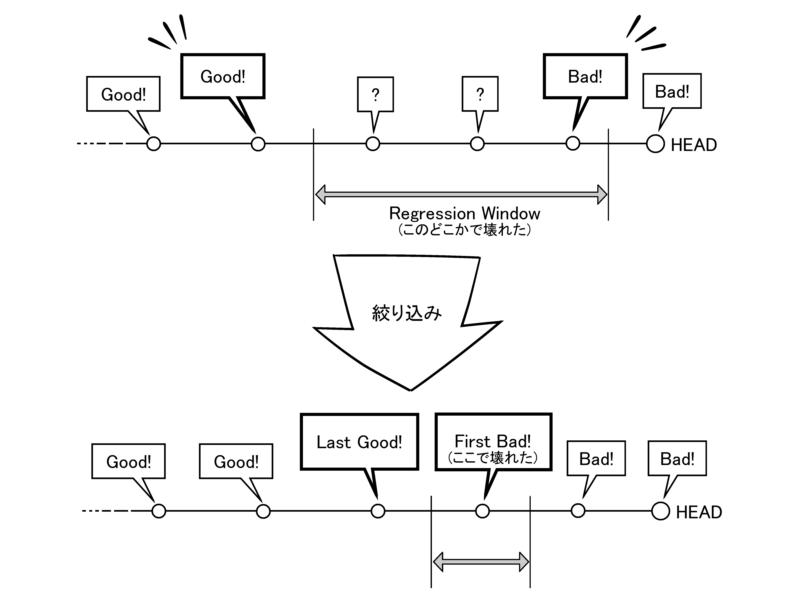
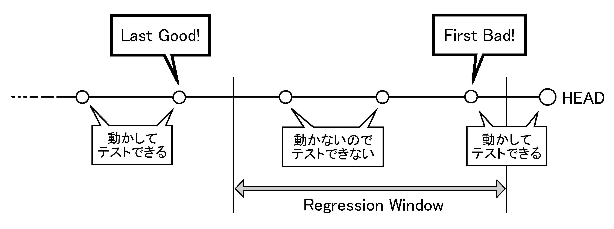
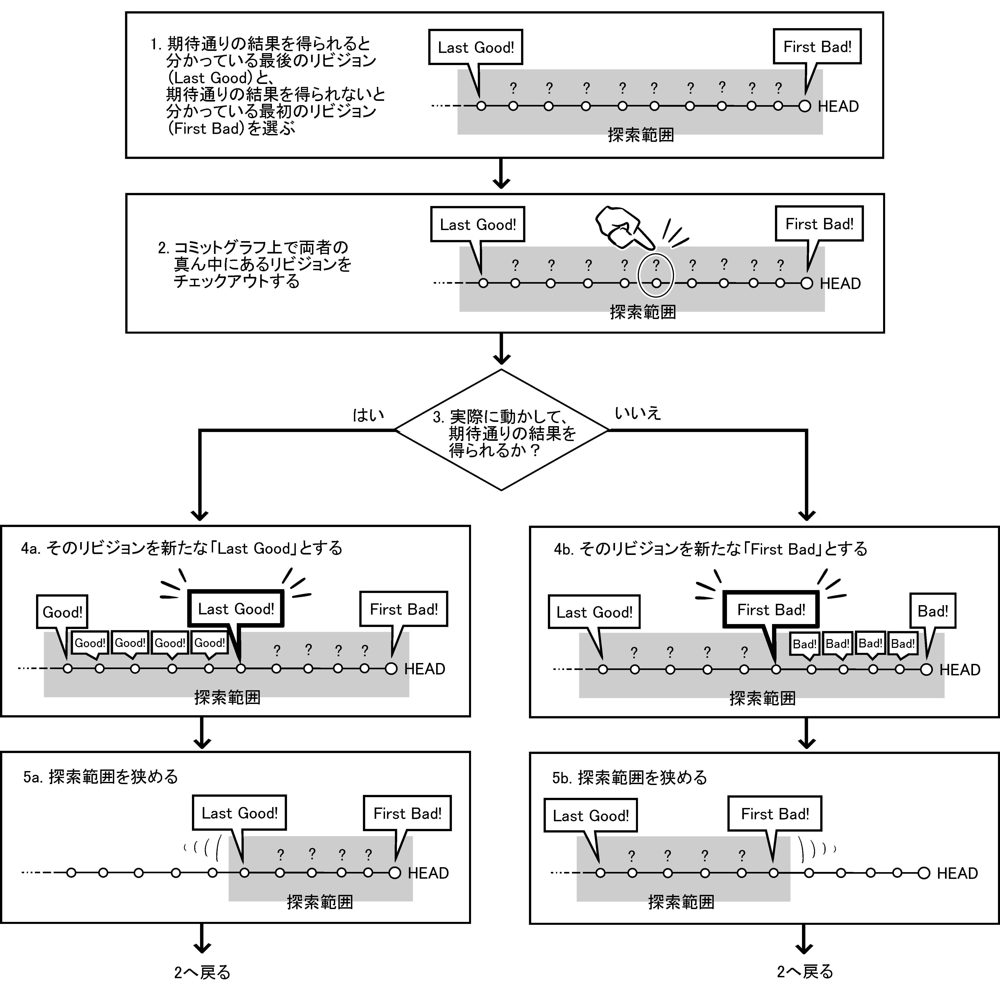

# どう報告すればいいのか分からない

フィードバックしたいOSSとフィードバックしたい内容、そして、フィードバックする先が決まりました。次は、実際にイシュートラッカーやメーリングリストに「報告」というフィードバックを行う際の、*より良い報告の書き方*を説明しましょう。

といっても、ここで説明する内容は、すでに業務でたくさんバグ票を書いているような人にとっては目新しい話ではないです。逆に、まだ業務でバグレポートを書くということを経験したことがない人や、いいレポートを書けずに困っているという人には、この章は業務の上でも役に立つかもしれません。

ポイントは、*開発者の負担が減るような報告にする*ということです。もしあなたがすでにソフトウェア開発の仕事をしているなら、あるいは、自分で作ったソフトウェアを長期間メンテナンスし続けているなら、不具合の修正に日々苦労しているのではないでしょうか。そんなときに*「こういう情報があると助かるのになあ」と思うような情報*こそ、報告に書くべき情報と言えます。


## 報告に欠かせない3つの基本要素

開発者コミュニティの目的は、ソフトウェアの改善・改良、ソフトウェアの問題を解決することです。よって、報告する内容もそれに沿ったものとなりあｍす。では、一体どんな情報があれば問題解決の役に立つのでしょうか？

一般的に「報告に必ず盛り込むべき要素」とされるのは以下の3点です。

* 再現手順（Steps to reproduce）
* 実際に得られる結果（Actual result）
* 期待される結果（Expected result）

再現手順とは、読んで字の通り、その現象を再現するために必要な情報です。つまずきが発生したとき、あなたが普段から使っている環境を開発者に物理的に差し出して直接見てもらえればいいのですが、一般的にはそれは不可能です。なので、*開発者は報告された再現手順に従って、自分の手元の環境で現象を再現させ、それを出発点として原因を調べる*ことになります。再現手順は、そのような使われ方をするということを念頭に置いてまとめなくてはなりません。

実際に得られる結果とは、あなたの環境で再現手順を実施したときの結果・状態の説明です。*開発者は報告された再現手順に従って、自分の手元の環境でこの結果を得ることをまず目指します*。あなたの報告に書かれた「実際の結果」を開発者が得られなかった場合、再現手順にまだ何か見落としがあったということになります。

期待される結果とは、あなたにとっての「どうなっていて欲しい」という状態の説明です。*開発者はこれを作業のゴールにします*が、場合によっては、これは*あなたがソフトウェアやプロトコルの仕様を正しく把握しているかどうかの判断材料*にもなります。あなたの期待がプロジェクトの目指す方向性と一致しなかった場合、機能追加の提案であれば却下され、不具合の報告であれば「仕様」として処理されることになります。

この3つのどれが欠けても、問題の解決は途端に難しくなります。これらは、マクロなシステムからミクロな関数まであらゆる規模の「問題」を表現するための基本原則と言えるでしょう。


プロジェクトによっては報告の書き方・形式を定めている場合がありますし、GitHubのようなサービスでは、イシュー作成用の「空欄を埋めるだけで適切な形式の報告を書けるようなテンプレート」（イシューテンプレート）が用意されている場合もあります。いずれにせよ十中八九どのプロジェクトでも、言い方は多少異なっていても[^variations-of-report-information]この3要素は必ず含めるように指定されています。

[^variations-of-report-information]: 例えば「実際に得られる結果」→「起こったこと」「現象」、「再現手順」→「やったこと」、「期待される結果」→「起こって欲しいこと」のような言い方になっている場合があります。

報告には他にも、以下のような情報を添える場合もあります。

* 不具合の報告か、新機能の要望か
* セキュリティ上の脆弱性かどうか
* 影響度はどのくらいの大きさか、どの程度深刻か
* どのモジュールに関する報告か

ただ、これらはあくまで*基本の3要素を踏まえた上での補足情報*です。プロジェクトの運営方針によっては、最低限基本の3要素が揃っていない報告は一律に却下される場合もあります。慣れないうちは特に、「自分がいかに困っているか」「その問題の影響度はどのくらいか」ということばかり一生懸命書いてしまいたくなるところですが、その気持ちはグッとこらえて、まずは基本の3要素をきっちり押さえるようにしましょう。


## 再現条件をまとめよう

報告の中で、労力的に最も大きなウェイトを占めるのが*再現手順の特定*です。実際に、開発の現場でも不具合の修正に要する時間のほとんどはそこに費やされていると言っても過言ではないでしょう。*不具合が修正されるかどうかは、ほぼ、「現象を確実に再現できる手順・条件」が明らかになっているかどうかで決まります*。

フィードバックするネタの見つけ方の話の中で、「OSS Gateワークショップではフィードバック初心者の方向けのファーストステップとして、公式の導入手順の中で遭遇したつまずきのフィードバックをおすすめしている」ということを述べました。このやり方をおすすめしているのには、*再現手順が明確だから*という理由もあります。「実際に行ってつまずいたときの操作手順」＝「公式の導入手順」で、改めて自分で手順を書き起こずとも、公式の資料を下敷きにできるからです。

他方、使い始めた直後ではなくある程度使い込んだ状態で不意に遭遇したつまずきは、再現手順を特定するのに苦労しがちです。

例として、筆者が[実際に行ったFirefoxのウィンドウの不具合の報告](https://bugzilla.mozilla.org/show_bug.cgi?id=1521692)の場合を考えてみます。出発点は、以下のようなメモでした。

* 開かれたポップアップウィンドウが閉じられなくなった。
* OSはWindows Server 2008。
* FirefoxのバージョンはESR60.1。

たったこれだけの、シンプルなメモです。これに対して、最終的に報告した内容は以下のようなものでした。

```
再現手順：

1. Windows 7が動作する環境を用意する。Windowsのデスクトップテーマは「クラシック」を選択する。
2. Firefox 64.0.2またはFirefox ESR60.4をインストールする。
3. Firefoxを起動する。
4. ツールバーの上で右クリックして、メニューの中の「メニューバー」にチェックを入れ、メニューバーを常に表示する状態にする。
5. キーボードショートカット「Ctrl-Shift-K」を入力して、Webコンソールを開く。
6. コンソールに`window.open('about:blank','_blank','toolbar')`と入力して、Enterキーを押す。
7. ポップアップウィンドウがFirefoxのポップアップブロッカーによってブロックされるので、「このサイト（～）によるポップアップを許可する」をクリックする。
8. 開かれたポップアップウィンドウのウィンドウコントロール[^window-control]部にあるクローズボックスをクリックする。

期待される結果：

* ポップアップウィンドウが閉じられる。また、最小化・最大化のボタンも機能する。

実際の結果：

* ポップアップウィンドウが閉じられない。また、最小化・最大化のボタンも機能しない。
```

[^window-control]: Windowsではウィンドウの右上にある「最小化」「最大化」「閉じる」の3つのボタンのこと。

そのソフトウェアの複数のバージョン・複数の実行環境で同じ現象が起こる場合、*前提条件にあたる部分は再現手順とは別立てで記載する*のもよいでしょう[^environment-in-str]。

[^environment-in-str]: 実際に、筆者が行った報告では2は「再現手順」の中には含めず、見出しを分けて後段で「現象が再現するFirefoxのバージョン」として別途記載しました。この例では説明のためにあえて、環境に関する情報も「再現手順」の中に収める書き方にしています。

最初のたった数行のメモから、どうやってこの報告を作ったのか。過程を詳しく見ていくことにします。


### まず「まっさらな環境」での再現を試みる

ソフトウェアを使い込んだ状態で不具合に遭遇した場合でも、筆者は基本的には、*現象が発生した環境やソフトウェアについて、いわゆる「まっさらな、クリーンな環境」を用意して、その時点で判明している手順だけから同じ現象が再現するかどうかを最初に調べます*。

まっさらな環境とは、理想的には以下のような状態を指します。

* OSは、インストールした直後の状態。
* 対象のソフトウェアは、公式の導入手順に従って導入した直後の状態。
* OSも対象のソフトウェアも、設定は可能な限り変更していない。
* 対象のソフトウェアは、まだ一度も起動されていない。（ユーザー設定は、2度目以降の検証をする前に初期化する。）

なぜそのような環境を用意するかというと、この章の冒頭で述べたとおり、報告に含める再現手順は*「開発者の環境でその通りに操作して現象を再現できる」手順*にする必要があるからです。まっさらな環境での再現手順を伝えることにより、開発者の側で現象を再現できる可能性、ひいては、問題が修正される可能性が高まります。

まっさらな環境は、Microsoft AzureやAmazon EC2のようなクラウドサービスでインスタンスを新規に作成したり、なるべく追加の出費を避けたい場合は[VirtualBox](https://www.virtualbox.org/)や[VMware Workstation Player](https://www.vmware.com/jp/products/workstation-player.html)などを使って自分で仮想マシンを構築したりして用意できます。問題の原因がハードウェアやそれに近い部分にあるような場合は、仮想環境ではなく物理的なハードウェアから用意しないといけない場合もあります。

そこまでの手間をかけられない場合でも、最低限、*そのソフトウェアのユーザー設定を削除（または退避）したり、現在の環境で新規にユーザーを作ってそちらでログインし直したり*して、普段自分が使っている状態よりはまっさらな状態に近い環境を用意するようにしましょう。この詳細についてはコラムを参照してください。

前述の例のケースでは、筆者は以下の環境を使いました。

* VirtualBox上の仮想マシン上のWindows 7[^windows-different-version]
* Firefox ESR60.1

[^windows-different-version]: 最初のメモに書かれた環境の「Windows Server 2008」と異なっているのは、最初のメモが元々、筆者が在籍する会社のサポートサービスの中でお客さまから寄せられたお問い合わせだったためです。Firefoxのようなデスクトップアプリケーションにおいては、Windows Server 2008とWindows 7、Windows Server 2012とWindows 8、Windows Sever 2016（およびWindows Server 2019）とWindows 10というように、対応関係にあるバージョンのWindows同士はほぼ同じ物と見なせます。


### コラム：普段使いの環境で手軽に「まっさらな状態」に近い状態を作る

現代の多くのソフトウェアは、ユーザー設定はソフトウェアのインストール先とは別の位置に保存されています。以下はその保存先としてよく使われるフォルダー（ディレクトリー）の位置です。

* `C:\Users\（アカウント名）\AppData\Roaming\（ソフトウェア名またはベンダー名）\`（Windows Vista以降のWindows）
* `/Users/（アカウント名）/Library/Application Support/（ソフトウェア名またはベンダー名）/`（macOS）
* `/home/（アカウント名）/.（ソフトウェア名またはベンダー名）/`（Linux、BSDなどのUnix系）

これらの場所にフォルダーがあれば、それを一時的にリネームする（例えば、`Mozilla`というフォルダーの名前を`Mozilla_`に変更するなど）と、普段のユーザー設定を残したまま、「まっさらな状態」でソフトウェアを起動できます。また、調査が終わったら、リネームしたフォルダー名を元に戻すだけで普段使いの状態に戻せます。

ただ、この方法には「普段使いの状態とまっさらな環境とを同時に動かして試せない」というデメリットがあります。また、WindowsのアプリケーションやUnix系環境でのGNOMEの設定などでは、上記の場所ではない特別な場所に情報を保存する例もあります。スマートフォンやタブレットでは、ユーザー設定の保存先に簡単にはアクセスできない場合もあります。そのような場合も含めると、「OSに新しいユーザーを作成して、全てのデータをユーザー単位で切り替える」というやり方の方がより安全で確実と言えます。


### 実際にやった操作を細かく書き出す

この「まっさらな環境」の上で、その時点で判明している手順を実施してみます。このとき、*自分がどのような操作を行ったか、画面の中で何が起こったかを、具体的に、可能な限り細かくメモに残していきます*。

前述の例では、当初判明していた手順は以下の通りでした。

* 開かれたポップアップウィンドウが閉じられなくなった。

これを確かめるために、筆者は実際には以下のように操作しました。

1. ポップアップを開くボタンを含むWebページを`http://example.com/popup.html`に用意する。
2. Windows 7を起動して、ログインする。
3. Firefox ESR60.1をインストールする。
4. デスクトップ上のFirefoxのアイコンをダブルクリックして、Firefoxを起動する。
5. Firefoxのロケーションバーに`http://example.com/popup.html`と入力し、Enterキーを押して、Webページを開く。
6. ページ内に含まれているボタンの上でマウスの左ボタンをクリックする。
7. Firefoxのポップアップブロッカーによってポップアップがブロックされる。
8. Firefoxのウィンドウ内に表示された通知のボタンの上でマウスの左ボタンをクリックする。
9. メニューが表示されるので、メニューの中の「このサイト（～）によるポップアップを許可する」の上でマウスの左ボタンをクリックする。
10. ブロックされたポップアップが開かれる。
11. ポップアップのウィンドウのクローズボックスをクリックする。
12. ポップアップのウィンドウが無事に閉じられる。（問題が再現しなかった）

この時点では残念ながら問題を再現できませんでした。が、それよりもここで注目して欲しいのは、*ここでの記録は当初のメモに比べてもっと細かい粒度になっている*ということです。

この例ではFirefoxというGUIアプリケーションを扱っていますが、コマンドラインインターフェース（CLI）のツールの場合でも要領は同じです。例えば[筆者が作成したBashスクリプト製Twitterクライアント](https://github.com/piroor/tweet.sh)での「複数行の発言を投稿できない」という問題であれば、最初の状況のメモは以下のような粒度の物です。

* 複数行の内容を含むファイルを作成して `./tweet.sh post $(cat file.txt)` と実行したが、投稿できなかった。

これに対して、まっさらな環境で実際に行った操作を詳細に記録した物は以下のようになります（説明を簡単にするために、一部説明を省略しています）。

1. Twitterのアカウントを作成する。
2. `https://developer.twitter.com/` を訪問する。
3. APIキー一式を発行する。
4. Ubuntu 18.04LTSを起動する。
5. 「端末」を起動する。
6. `sudo apt install git`を実行する。（必要なツールのインストール）
7. `git clone https://github.com/piroor/tweet.sh.git`を実行する。（リポジトリのローカルへの複製）
8. `cd tweet.sh`を実行する。（作業ディレクトリーの変更）
9. `vim ~/.tweet.client.key`を実行する。（設定ファイルの作成）
10. 先ほど発行したAPIキーを使って、以下の内容でファイルを上書き保存する。
    
    ```
    MY_SCREEN_NAME=（アカウント名）
    MY_LANGUAGE=ja
    CONSUMER_KEY=（発行したコンシューマーキー）
    CONSUMER_SECRET=（発行したコンシューマーシークレット）
    ACCESS_TOKEN=(発行したアクセストークン）
    ACCESS_TOKEN_SECRET=（発行したアクセストークンシークレット）
    ```
11. `vim file.txt`を実行する。（データファイルの作成）
12. 以下の内容でファイルを上書き保存する。
    
    ```
    line 1
    line 2
    ```
13. `./tweet.sh post $(cat file.txt)`を実行する。（投稿の操作）
14. `{"errors":[{"code":32,"message":"Could not authenticate you."}]}`と表示される。
15. Webブラウザで確認用に`https://twitter.com/（アカウント名）`を開くと、先ほどの内容は投稿されていない。

CLIの場合、*実際に実行したコマンド列と、その結果出力された内容をありのままに記録する*ことがポイントとなります。

この段階では、手順を*自分で「細かすぎる」と思うくらいに細かく書くように意識する*のがよいです。というのも、*報告に不慣れな人ほど、荒く・情報が不足した報告を書いてしまいがち*だからです。入れすぎた情報を後で削るのは容易ですが、不足した情報に後から気付くのは難しいです。最終的な報告の形に馬止上げるまでは、基本的には*情報は常に多めに盛り込むようにする*ことを心がけるとよいでしょう。

この段階でもし現象が再現するようであれば、再現手順の特定は完了したと言えます。この時点でできた詳細な手順の記録を、そのまま報告の中に「再現手順」として記載しましょう。現象が再現しなかった場合は、これを出発点として、次に述べる手順で再現条件を絞り込んでいくことになります。


### さらに再現条件を絞り込む

まっさらな環境で現象を再現できなかった場合、実際に現象が起こった状況との間で何か違いがあるということになります。その違いを一つ一つ炙り出していくのが、*再現条件の絞り込み*です。

今度は、*先ほどと同じくらい細かい粒度で操作を記録しつつ、まっさらな環境での状況との違いをつぶさに観察しながら、実際に現象が起こっている環境で現象を再現させてみます*。すると、自分で思っていた以上に細かい所で「違い」があることに気が付くはずです。前述のFirefoxの例では、以下のような点が実際に差異としてありました。

* Windowsにログオンした時点で、画面の様子が違う。実際の状況ではウィンドウのデザインが地味になっている。デスクトップテーマを「クラシック」に切り替えていた。
* Firefoxを起動した時点で、ウィンドウの様子が違う。実際の状況ではメニューバーが表示されていた。メニューバーを常に表示するように設定を変えていた。
* 実際の状況では、ポップアップはとある社内システムのページのボタンをクリックして表示していた。
* 実際の状況では、ポップアップはブロックされなかった。ポップアップブロック機能を無効化していた。
* 実際の状況では、ポップアップにはツールバー以外のGUIが表示されていなかった。ポップアップを開くときの`window.open()`の第3引数のフラグ指定が異なっていた。

このようにして炙り出されたさまざまな差異について、まっさらな環境に一つずつ反映していき、どこまで反映した時点で現象が再現するかを調べます。もしすべての差異を反映してもまだ現象が再現しない場合には、まだ差異の炙り出しが足りないということになります。観察の精度をもっと上げて、今まではスルーしていたような、さらに細かい差異にも注目するようにしましょう。

現象を再現できたら、今度は不要な条件が残っていないかを調べるために、変更した部分を一つずつ戻していきます。というのも、現象の再現に必要ない手順がたくさん残っていると、報告を見た開発者が手順を試すときにノイズとなるからです。

また、手順の中で実際のWebサイトなどの外部リソースに依存する部分があれば、静的なローカルファイルなどで置き換えられるかどうかも検討してみます。というのも、例えば「このページで現象が再現する」という例をURLで示したとして、そのURLに開発者がアクセスできない可能性があるからです。この例でも、`http://example.com/popup.html`という外部リソースを使わずにデバッグ用コンソールを使うなどの代替手段を取れないかを検討しました。

こうして「現象を再現するために必要な最小の条件」を盛り込むと、先のFirefoxの例の再現手順は、以下のようになりました。

1. Windows 7が動作する環境を用意する。Windowsのデスクトップテーマは「クラシック」を選択する。
2. Firefox ESR60.1をインストールする。
3. Firefoxを起動する。
4. ツールバーの上で右クリックして、メニューの中の「メニューバー」にチェックを入れ、メニューバーを常に表示する状態にする。
5. キーボードショートカット「Ctrl-Shift-K」を入力して、Webコンソールを開く。
6. コンソールに`window.open('about:blank','_blank','toolbar')`と入力して、Enterキーを押す。
7. ポップアップウィンドウがFirefoxのポップアップブロッカーによってブロックされるので、「このサイト（～）によるポップアップを許可する」をクリックする。
8. 開かれたポップアップウィンドウのクローズボックスをクリックする。

ポップアップブロックの有効・無効は現象に関係しませんが、最小の条件のみを整えた状況ではポップアップがブロックされることから、手順の中にブロック解除の操作も明示的に含めています。

このようにして特定した再現条件を添えて報告しても、開発者の環境では現象を再現できない場合があります。それは、*「まっさらな環境」として用意した物の時点ですでに、自分の環境と開発者の環境に差異がある場合*です。「ユーザー設定を削除」「OSのユーザーを切り替える」といった簡易的な方法で「まっさらな環境」を用意していた場合、ハードウェア構成やシステムにインストールされたユーティリティなどの点にまだ条件が潜んでいる可能性が考えられます。余力があれば、別のPCを用意したり仮想環境を用意したりして、それらのレベルでもより「まっさら」な状態との差異を炙り出すようにしましょう。例えば筆者の経験上は以下のような点が再現条件として挙がる場合がありました。

* OSが64bit環境か、32bit環境か。
* ソフトウェアが64bit用か、32bit用か。（Windowsでは32bit用のソフトウェアを64bit環境でも動かせるため）
* システムの言語は日本語か、英語か。
* Windowsのユーザー名は「user」のように英数字のみか、「検証　太郎」のように日本語の文字を含んだ名前か。
* Windowsのワークグループ名は「WORKGROUP」（既定）のように英数字のみだったか、「検証　組織」のように日本語の文字を含んだワークグループ名か。
* Windowsはドメインに参加しているか、していないか。
* Windows Serverの場合、ドメインコントローラか、ただのドメイン参加か。
* マルチディスプレイか、シングルディスプレイか。マルチディスプレイなら、どのディスプレイでも再現するのか、特定のディスプレイでだけ再現するのか。
* Hi-DPI環境なのか、そうでないのか。

また、操作の違いも再現条件となっている場合があります。GUIアプリケーションでは一つのことをするために複数のやり方・操作の仕方がある場合があり、どの方法を取るかによって再現したりしなかったりしますので、以下のような点も差異として炙り出す必要があるかもしれませｎ。

* マウスで操作したのか、キーボードで操作したのか、画面をタッチして操作したのか。
* マウスでの操作なのであれば、どのボタンを押したのか。どの時点でボタンを押し下げ、どの時点でボタンを放したのか。どのくらいのスピードで動かしたのか。
* キーボード操作なのであれば、どのキーを押したのか。どの時点でキーを押し、どの時点でキーを放したのか。どのくらいのスピードでキーを叩いたのか。


### 「最新版」に気をつけよう

再現条件を特定できたら、その現象がそのソフトウェアの「最新版」でも同じ手順で再現するかどうかを調べましょう。もしあなたが使っていた版が少し古い版で、最新版では現象が再現しないのであれば、その現象は不具合としてすでに修正された可能性があります。

ところで、「最新版」という言葉の取り扱いには注意が必要です。*単に「最新版」と言った場合、実際には複数の対象が該当し得ます*。いくつか有名な例を挙げてみましょう。

|    | 例 |
| -- | -- |
| 開発中の本当の最新版 | Firefoxでの「Nightly」、Google ChromeでのChromiumや「Canary」、Debianでの「Sid」など |
| コンシューマー向けの最新版 | Firefoxでの「通常リリース版」、Google Chromeでの「安定チャンネル」など |
| 法人向け長期サポート版の最新版 | Firefoxでの「ESR（Extended Support Release）」、Ubuntuでの「LTS（Long Term Support）」など |

このように「最新版」という言い方は曖昧なので、報告では必ず「バージョンESR68.4.1」のように*具体的な番号を明記する*ようにしましょう。分からない場合は、どうすればバージョン番号を調べられるか質問すると大抵はこころよく教えてもらえるはずです。

先のFirefoxの報告の例では、現象が発生したのは「ESR60.1」でしたが、その時点でのFirefox ESRの最新版はすでに「ESR60.4」でした。そこで、ESR版の最新版であったESR60.4と、一般向けの最新版であった64.0.2、および開発者向けの最新版でも同様に状況を調査した結果、ESR60.4と64.0.2でのみ現象が再現し、開発者向けの最新版では現象は再現しませんでした。言い換えると、しばらく更新が継続するESR版で現象がまだ修正されていなかったことから、報告する意義のある問題と考えて報告することにしたのでした。


### 画像や動画など、文字以外のメディアも使っていい

ところで、ここまでずっと文字情報（文章）での再現条件の示し方を述べてきましたが、報告は必ず文章でしなければならないということはありません。

画像編集や表示に関わるソフトウェアであれば*スクリーンショット*、動画編集や再生に関わるソフトウェアであれば*スクリーンキャスト*（画面上のソフトウェアの動作を撮影した動画）、GUIを持つソフトウェアのGUI上の現象であればその両方が、説明の有効なツールとなり得ます。スクリーンショットやスクリーンキャストの保存の仕方が分からない場合は、*PCの画面をスマホで撮影・録画してアップロードする*という方法もあります。また、スクリーンショットは矢印や丸などを描き込んで説明に使うこともできます。スクリーンショットやスクリーンキャストには、*再現条件・実際に得られた結果・期待される結果のそれぞれについて文字での説明では見落とされていた詳細*が写り込むこともあり、開発者にとっては情報の宝庫と言えます。

複雑な処理の流れが関係する報告であれば、*フローチャートのような図*を使うのも有効かもしれません。画面上で図を用意するのが大変な場合、*紙にペンで描いた図を写真に撮る*という方法もあります。

また、プログラムやデータを実際に作れるのであれば、*それを使って実行すれば必ず現象が再現するというテストケース*を添付するのが最も有効です。サーバーサイドのソフトウェアであれば、*Dockerコンテナなどの形で実行環境そのものをテストケース代わりにする*というやり方もあり得るでしょう。

報告で大事なのは、*開発者の手元で現象を再現してもらい、現象が起こったときの様子を開発者が詳しく調べられるようにすること*です。手段を選ばず、自分にできる限りの表現方法を使って情報を伝えるようにしてみてください。


## 後退バグを報告しよう

不具合にはいくつかの典型的なパターンがありますが、その中でも特によく見られる物に「*regression*」（日本語では「*リグレッション*」や「*後退バグ*」と表記）があります。これは、「今まで正常に動いていた機能が、別の箇所の変更の影響を受けて、意図せず壊れてしまった」という種類の不具合のことを指す言葉です。「自分が愛用しているソフトウェアのよく使っている機能が、最新開発版では動かなくなっている」という状況を発見したときは、後退バグを報告するチャンスです。

### regression windowを特定しよう

後退バグの報告では、「再現手順、実際の結果、期待される結果」の基本の3要素に加えて「*regression window*」（または「*regression range*」）の情報があると開発者に非常に喜ばれます。これは、コミットグラフの中の「このリビジョンからこのリビジョンまでの間のどこかで機能が壊れて後退バグが発生した」という範囲のことです。例えば、最新のコミットで機能が壊れたのであれば、regression windowは最新のコミット1つだけということになります。



regression windowが特定されていると、「どの変更が原因で壊れたのか」の調査がその範囲の中だけで済むため、修正に必要な労力が大幅に軽減されます。迅速な修正には欠かせない情報と言えます。

### コラム：「regression point」ではない理由

regression windowを特定するには、後退バグが発生した機能について「期待通りの動作結果を得られていた最後のリビジョン」と「期待通りの動作結果を得られなかった最初のリビジョン」の2つを特定する必要がありますが、そのためにはそもそも、そのソフトウェアを実際に動作させて結果を確認する必要があります。

ところが、「これらのコミットは一組になっていて、その前とその後のリビジョンは起動できるが、これらのリビジョンの間はどれを取っても起動すらできない」というコミット群の中に原因があると、後退バグの出所を単一のコミットにまで絞り込むことは不可能となります。また、「動かして動作を確かめられるビルドが1コミットずつには提供されていない」という場合も、絞り込める範囲はビルドが提供されているコミット同士までに制限されます。このようなケースがあるため、ある程度の幅を持つ「window（窓）」という表現が使われているのでしょう。



### 二分探索をしよう

regression windowの特定によく使われるのが、二分探索という調査の仕方です。以下のフローチャートを見てください。



<!--
```
1. 期待通りの結果を得られると分かっている最後のリビジョン（Last Good）と、期待通りの結果を得られないと分かっている最初のリビジョン（First Bad）を選ぶ。
↓
2. コミットグラフ上で両者のちょうど真ん中にあるリビジョンを取得する。
↓
3. ソフトウェアを実際に動かして、期待通りの結果を得られるかどうか？
↓               ↓
Yes              ↓
↓               ↓
4a. そのリビジョンを新たな「Last Good」として、探索範囲を狭める。
↓               ↓
2に戻る          ↓
                 ↓
                 No
                 ↓
    4b. そのリビジョンを新たな「First Bad」として、探索範囲を狭める。
                 ↓
               2に戻る
```
-->

このようにすると、最悪の場合でも最小の試行回数で「このリビジョンから後退バグが発生した」というリビジョンを特定できます。

この調査の仕方は広く使われていて、ツールの側にもこれを支援する仕組みがあります。例えば、Gitには`git bisect`というサブコマンドがあり、これを使うと、ユーザーは「Gitがcheckoutしてくれたリビジョンの動作を試して、結果が期待通りかどうかを答える」という操作を繰り返すだけで、Gitが自動的に二分探索を進めてくれます[^git-bisect]。同様の機能がMercurialにも`hg bisect`というサブコマンドとして実装されています。

[^git-bisect]: 具体的には、`git bisect start （壊れていることに気付いたリビジョン） （正常に動作していたリビジョン）`と実行するとその間のリビジョンがチェックアウトされます。動作確認の結果が正常なら`git bisect good`を、壊れていれば`git bisect bad`を実行すると、さらに別のリビジョンがチェックアウトされます。

また、Mozillaは[mozregression](https://mozilla.github.io/mozregression/)というツールを公開しており、これを使うと`git bisect`と同様のことをFirefoxやThunderbirdの自動ビルドされたバイナリを対象に行えます[^mozregression-usage]。

[^mozregression-usage]: mozregressionのWindows用GUI版の使い方については、https://www.clear-code.com/blog/2018/7/18.html に筆者による日本語での解説があります。

自動テストによるCI（継続的インテグレーションテスト）が運用されており、テストが失敗するコミットに対しては自動的にエラーが通知されるというような仕組みがあれば、理想的には後退バグが見過ごされたままにならないはずです。が、実際には規模の大きなソフトウェアや複雑なソフトウェアでは、後退バグがCIをすり抜けてしまうことが度々あります。後退バグが残ったまま正式版がリリースされてしまうと、各方面に甚大な影響を与えかねないので、皆さんも普段から使っているソフトウェアで後退バグを見つけたら、まめに報告するようにぜひ心がけましょう。
