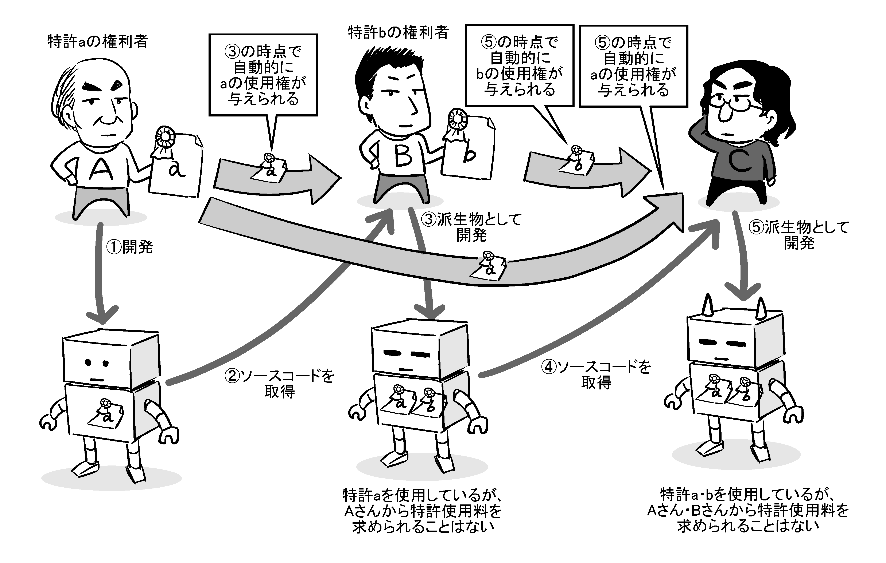
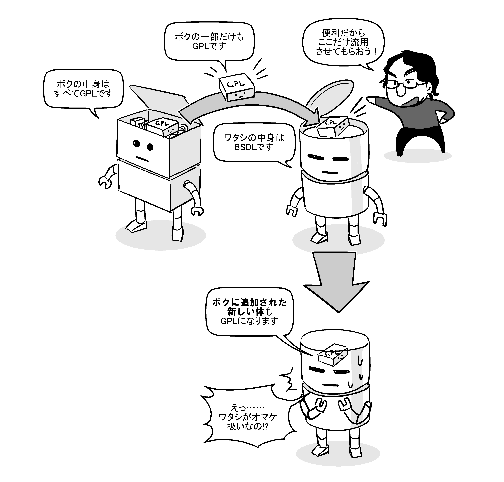

# ライセンスについてより正確に知る

本書では、「フィードバックは身近な小さなつまずきから始めよう」と述べてきました。なので、皆さんがする「初めてのプルリクエスト」も、おそらく、その変更箇所の著作権をわざわざ主張したいとも思わないような、ごくごく簡単な内容になっていることでしょう。

しかし、経験が増えてきて難しい課題にチャレンジし始めると、「このコードを書いたのは自分だ」とアピールしたくなってくるかもしれません。また、他のOSSのコードを参考にしたい、あるいは、そのコードをそのまま引用して使いたい、と思う場面が出てくるかもしれません。

そういうときに重要になってくるのが、ライセンスです。本章では、OSSでの著作権とライセンスについて、「とりあえずこれだけ知っていれば無駄にビクつかずに済む」という基本的な知識を解説します。

## コードと著作権

### 著作権の基礎

文章や絵、音楽、映像、プログラムなど、「作者の思想や感情を表現したもの」を一般的に「著作物」と言います。「著作権」は、著作物の作者に固有のものとして認められる、*その著作物の利用のされ方を決める権利*[^use-of-product]のことです。

[^use-of-product]: 日本の著作権法上は、単純に消費者として本を読んだり絵を見たりする「使用」と、商売として本を売ったり新たな表現として絵を別の絵に貼り込んだりする「利用」とを区別して考えます。

たとえば、「本を勝手にコピーして海賊版を作って販売してはいけない」のは、その本の著作権者に「著作物をコピーしたり販売する権利を、他の人には分け与えていない」からです。逆に、OSSのように著作権者が「著作権者名を明示してくれる人には、この本の内容を好きに利用できる権利を分け与える」とルールを定めていれば、そのルールに則って、本の複製を勝手に販売してもいいことになります[^free-to-distribute]。

[^free-to-distribute]: ただ、それを買ってもらえるかどうかは別の話です。あなたが高値を付けて販売している横で、別の人が無料で同じ物をばら撒いていたら、恐らく多くの人は無料の方に行くでしょう。買ってもらうためには、「こっちで売ってる物は綺麗な装丁になってますよ」「こっちで買ったら読み上げ音声も付けますよ」といった風に、お金を出してでも手に入れたくなるような付加価値が必要になってきます。「OSSのサポートビジネス」は、まさにその付加価値を売る商売と言えます。

詳しくはまた後で述べますが、OSSとは、著作権者が「このソフトウェアはこういう条件のもとで自由に利用して構わない」と条件を設定したソフトウェアです。そのようにライセンスを設定してくれているお陰で、皆さんは「勝手に著作物をコピーしやがって！」と殴り込まれることもなく、安心して「リポジトリをフォークして、編集して、プルリクエストを提案する」ということができるわけです。

### プルリクエストで提供するコードは誰の物？

日本の著作権法は無方式主義といって、特に役所等に届け出なくても、著作物を作った時点で著作権が発生することになっています。

ですが、場合によっては著作権が認められないこともあります。プログラムの領域でいうと、*オリジナリティが無いコード*がこれにあたります。

具体的には、「公知の情報そのままに書かれたコード」「誰が書いてもそうとしか書かれ得ないコード」がそれに該当します。`alert("Hello, world.");` のような一文は、その例としてよく挙げられます。OSSへのプルリクエストで提供されたコードの著作権について法廷で争われた事例を、筆者は寡聞にして把握していないのですが、恐らく誤記の修正程度の変更はこれと同様に扱われるのではないかと思います。

しかし、「既存のコードを変更したもの」の権利がどうなるかは、筆者も含めて素人には判断が難しいです。コードの提供者が、フィードバック時には「いいよいいよ、権利なんて気にしないで」と言っておいて、後から「この部分の権利は私が持つから使用料を払え」と主張し始める、というようなことが起こると、プロジェクトに大きな混乱を招きかねません。裁判をすれば「この提供されたコードには著作権は認められない」といった判決を得られる可能性はありますが、誰が訴訟に対応するのか、その費用は誰が出すのか、そもそもそんなことの対応に時間を取られてよいのか、といった問題があるため、実現性は低いです。

このような理由から、著作権の管理に気をつけているプロジェクトでは、コードを提供する人に*貢献者ライセンス同意書（Contributor License Agreement、略してCLA）*、あるいはそれに類する文書へ署名して、提供するコードの諸権利をプロジェクトに譲渡することを求めている場合があります。たとえばGNU Emacsプロジェクトでは、[「変更の累積行数が15行を超えるなら権利譲渡の必要がある」としています](https://ayatakesi.github.io/emacs/26.2/html/Copyright-Assignment.html)。

### 「ライセンス」とは？

OSSの文脈で一般に「ライセンス」と呼ばれる物は、著作権に基づいて「こういう利用の仕方は許可する」「こういう利用の仕方は許可しない」といった利用許諾条件をあらかじめ記載しておいた物のことを言います。*いちいち著作権者に許諾を求めなくとも、ライセンスに記載された通りの条件に従う限りは、勝手に二次利用して問題はありません*。

ライセンスは複数種類設定される場合もあります。以下はその例です。

* プログラミング言語のRubyのC実装（いわゆるC/Ruby）は、「Rubyライセンス」と「2条項BSDライセンス」の2つのライセンスが設定されていて、利用者は「どれか1つの条件に従うか、もしくは、両方の条件に従う」という選択が可能です。
* かつてFirefoxのソースコードは「MPL1.1」「GPL2」「LGPL2.1」の3つのライセンスが設定されていて、利用者は「どれか1つの条件に従うか、もしくは、3つすべての条件に従う」という選択が可能でした。
* MySQLは「GPL2、もしくは商用ライセンス」の二者択一になっています。

もちろん、ライセンスで許諾されていない使い方でも、著作権者の特別の許可を得られれば、得られた許可の範囲でそのOSSを使うことはできます。

### [column]「ライセンス」の綴り

アメリカ英語ではライセンスはlicenseという綴りしかありませんが、イギリス英語ではlicen*c*eという別の綴りの単語があります。licen*s*eの誤記*ではない*ので注意が必要です。

それぞれの使い分けは以下の通りです。

* license：動詞としてのライセンス（許諾を与えるという行為）
* licence：名刺としてのライセンス（与えられた許諾そのもの）

誤記だと思って勝手に「licence」を「license」に変更するプルリクエストを出すと、恐らくイギリス人に叱られますので、気をつけてください。

### [/column]

## オープンソースの定義って？

### 「自由に使っていいよ」と言っていれば「オープンソース」、とは限らない

OSSは、著作権者が「このソフトウェアはこういう条件のもとで自由に利用して構わない」と条件を設定したソフトウェアだ、と述べました。ですが、これは非常に雑な説明で、実際にはもっと厳密な定義があります。

「オープンソース」という言葉は、1998年にアメリカのパロアルトで作られました。以降2019年現在に至るまで、オープンソースという言葉の意味はオープンソースイニシアティブ（OSI）という団体によって明確に定義されています。

OSIによるオープンソースの定義は、要約すると以下のようになります。

1. *再頒布の自由*：元の作者でもそうでなくても、そのソフトウェアを自由に販売したり無償配布したりできること。
2. *ソースコードの入手性*：誰でもソースコードを入手できること。製品にソースコードを添付できない場合は、別途入手できる手段を提供すること。
3. *派生ソフトウェアの容認*：誰でもそのソフトウェアを改造できて、同じ条件のもとで再頒布できること。
4. *作者のソースコードの完全性*：元のソースコードを改変した物を直接再頒布することを許可しない場合、「元のソースコード」と「それに対して変更を反映するパッチ」をセットにして再頒布できること。
5. *個人やグループに対する差別の禁止*：特定の人や集団・組織を問わず、誰でもそのソフトウェアを利用できること。
6. *利用する分野に対する差別の禁止*：平和のためでも、戦争のためでも、学術のためでも、営利のためでも、目的を問わず何のためにでもそのソフトウェアを利用できること。
7. *ライセンスの分配*：元のソフトウェアを一切改変せずそのまま再頒布する場合、追加の条件を必要とせず元の物と全く同じ条件でそのソフトウェアを受け取れること[^osd-7]。
8. *特定製品でのみ有効なライセンスの禁止*：そのソフトウェアが何らかの製品の一部としてのみ使えるという形ではなく、取り出して単独でも使えること。
9. *他のソフトウェアを制限するライセンスの禁止*：そのソフトウェアを、他の条件の下で頒布されるソフトウェアと共に頒布できること。
10. *ライセンスの技術中立的性*：利用許諾条件それ自体を、PCやスマートフォンやウェアラブルデバイスなどのハードウェア、画像や音声などのメディアを問わず、誰でも容易に確認できること。

[^osd-7]: これは、「改変したソースの配布は禁止するが、元のままのソースと、改変するための差分（パッチ）の配布は認める」というソフトウェアを想定しています。具体的には、TeXの実装がこれにあたります。

これらの条件を満たす利用許諾条件を「オープンソースライセンス」、そのような利用許諾条件が設定されたソフトウェアを「オープンソースソフトウェア（OSS）」と呼びます。

OSIでは、OSIが「確かにこのライセンスはオープンソースの定義に合致している」と[認定したライセンスの一覧をWebサイト上に掲載しています](https://opensource.org/licenses/alphabetical)。

### 実は「OSS」ではないケース

[Unityちゃんライセンス2.00](https://unity-chan.com/contents/license_jp/)には「公序良俗に反する行為や目的、反社会的な行為や目的、特定の信条や宗教、政治的発言のために利用しないこと」という条件がありますが、これは前述の条件の6番目に合致しません。著作物を宣伝や広告に利用することや、キャラクターの価値を下げる利用の仕方を禁止している[ピアプロ・キャラクター・ライセンス](https://piapro.jp/license/pcl/summary)、あるいは、[RedisやMongoDBなどが商用クラウドベンダーによるソフトウェアの使用を制限するようとに設定したライセンス](https://www.sbbit.jp/article/cont1/36018)にも、同じことが言えます。

では、上記の「オープンソースの定義」を満たすようにライセンスを定義すれば、それでもう「オープンソースライセンス」を名乗ってもいいのでは？　と思うかもしれませんが、それも早計です。というのも、OSIは*OSIがオープンソースライセンスだと認定してWebサイト上の一覧に記載した物以外をオープンソースとは呼ばない*ように[求めている](https://opensource.org/faq#avoid-unapproved-licenses)からです。これは、オープンソースの定義に合致しない可能性がある物が広まってしまうと「オープンソース」という言葉の意味が揺らいでしまうためです。

そういう意味で厳密には「OSS」ではない物の例としては、HTTPサーバーの[Nginx](https://nginx.org/en/)が挙げられます。Nginxの公式サイトには、トップページ上に「The sources and documentation are distributed under the 2-clause BSD-like license.（ソース及びドキュメントは2条項BSD*ライク*ライセンスで配布されます。）」と書かれていますが、2条項BSD*ライク*ライセンスはOSIのオープンソースライセンス一覧に記載されていません[^bsd-like]。

[^bsd-like]: 「ライク」が付かない「2条項BSDライセンス」は載っています。なお、実際のライセンスの内容を確認すると、「文面は2条項BSDライセンスとほぼ同じで、一部のみ記述が異なる」という物になっていました。

OSSではない物をOSSと誤認して二次利用すると、もしかしたら訴訟を起こされたり賠償を求められたりするかもしれません。ライセンスに関する情報を見つけられない場合は安全側に倒して、OSSではないと判断する事を筆者はお勧めします。

なお、GNUプロジェクトで言うところの「自由ソフトウェア（フリーソフトウェア）」については特にそのような認定は行われていない様子で、後述するの4つの条件を満たしていれば自由ソフトウェアと呼んでよいらしく、Nginxはこちらの条件を満たしています。なので、Nginxは「OSSではないが自由ソフトウェアである」という事になります。

### オープンソースと特許権

ところで、ソフトウェアは著作物ですが、特許の影響を受ける場合があります。

特許権とは、「発明」をした人（発明者）に与えられる独占的な権利で、著作権とは独立しています。そのため、著作権の範囲では自由に利用していいけれども、特許料の支払いは別途求める、ということも理論上は可能です。OSSでも同じことは言えて、あるOSSに特許に抵触する内容が含まれていたときに、その派生物を作った人が、元のソフトウェアの作者から（かってに他人の特許を使った製品を配っている、と）特許権の侵害で訴えられる、という可能性はあることになります。

そのためOSSライセンスの中には、「そのライセンスに従ってソフトウェアを利用する人に対しては特許の使用を許可し、特許料の支払いを求めない」ということを条件の中に明確に盛り込んでいる物もあります。MPLやGPLバージョン3、Apacheライセンスのバージョン2などはこれにあたります。

ただ、これはあくまで、ソフトウェアの著作権者が特許権者でもある場合に有効な話です。全く無関係の別の人が特許権を持つ機能をソフトウェアに含めてしまった場合、普通にその権利者から特許使用料を請求されたり、訴訟を起こされたりすることも考えられるので、「このオープンソースライセンスなら特許を気にしなくてもいい」といった早合点は禁物です。

その他にも、「第三者相手に特許訴訟を起こした場合、そのOSSに元々含まれていた他の人の特許について使用権を剥奪される」「特許で保護された部分の改変には特許権者の許諾が必要」など、特許に関する条件はライセンスによって異なる部分があり、素人判断は危険と言わざるを得ません。*自社で特許権を持つ技術を、既存のOSSに提供したりOSSとして公開した入りする場合は、知財部門や顧問弁護士などによるチェックを必ず受けるように注意してください*。

## コピーレフト型のライセンスで気をつけること

### コピーレフトと非コピーレフト

オープンソースライセンスには大別して、コピーレフト型と非コピーレフト型の2種類があります。

コピーレフト（Copyleft）とはコピーライト（Copyright：著作権）をもじって作られた言葉で、*ある著作物について、その派生物についても同じ条件での利用を許諾することを、利用の条件とする*という概念です。平たく言えば、「私の作ったこのソフトウェアを自由に改造して使っていいですよ。ただし、改造した結果のソースコードを、そのユーザーにも自由に使わせてくれるならね」というような話です。この性質を持つライセンスをコピーレフト型と言う場合があり、GPL（GNU General Public License）はその代表例です。

それに対して、コピーレフト性を持たないオープンソースライセンスは非コピーレフト型と言います。平たく言えば「改造結果を完全に秘匿して構いませんよ」ということで、BSDライセンスやMITライセンス、Apacheライセンスなどがこれにあたります。

コピーレフト型のライセンスでも、ライセンスによってコピーレフト性の強さには違いがあります。以下にいくつか例を挙げます。

* コピーレフト性が弱いMPL（Mozilla Public License）では、MPLだったファイルの派生物はMPLとする必要がありますが、後から追加したファイルまでMPLとする必要はありません。
* コピーレフト性が中程度のLGPL（GNU Lesser General Public License）では、そのソフトウェア自体の派生物はLGPLとする必要がありますが、ライブラリとしてLGPLのソフトウェアを使う場合[^lgpl]、その呼び出し元のソフトウェアまでLGPLとする必要はありません。
* コピーレフト性が強いGPLでは、そのソフトウェアに追加されたすべてのコードをGPLとする必要があります。ただし、そのソフトウェアによって提供されているサービス（SaaS）のユーザーにまでは、ソースコードを提供する必要はありません。
* 最もコピーレフト性が強いAGPL（Affero GPL）では、SaaSのユーザーにもソースコードを提供する必要があります。

[^lgpl]: LGPLはC言語などのコンパイル型の言語を想定して策定されているため、ここでの想定は「DLLや.soのように、実行時に動的に読み込む場合は、ライブラリとしての呼び出しにあたる。配布される1つのバイナリの中に静的に組み込む場合は、派生物にあたる」ということになっています。

### 「GPL汚染」って何？

コピーレフト性を持つライセンスでは、派生物にも同じライセンスを設定することが求められます。これは一般的には、「GPLのソフトウェアを改変したら、改変後のソフトウェアもGPLになる」というようなことを意味しています。

ただ、場合によっては、この「改変部分」の大きさが主従逆転することがあります。

たとえば、自社のプロプライエタリな製品の中にGPLのソフトウェアの一部を引用したとします。すると、これはコード量としては「プロプライエタリな部分が主、GPLの部分が従」です。著作権法では、分量や文脈から主従関係が明白な場合を「引用」と定義していて、著作物の権利は主となる著作物の権利者の方が持つことになります。

しかし、*GPLのソフトウェア側から見た場合は、あくまで「全体がGPLのソフトウェアの派生物」ということになります*。そのため、このプロプライエタリな製品全体にGPLを適用する必要が生じます。

このような、一部でもGPLのコードが混入すればGPLでなかったほかの部分まですべてGPLになってしまう、という様子をウィルス感染や放射能汚染のようにたとえて言った言葉が、「GPL汚染」です。OSSにフィードバックする場面でも、ライセンスがApacheライセンスやBSDライセンスなどの非コピーレフト型であるOSSに対して、GPLのソフトウェアから一部を引用したり全体を組み込んだりすると、この「GPL汚染」が起こることになります。そのため、このようなプルリクエストは却下されると思っておいた方がいいです[^isolate-copyleft]。

[^isolate-copyleft]: そのプロジェクトが非コピーレフトなライセンスをわざわざ選択していることには、非コピーレフトでないといけない理由がある、と考えられるからです。たとえば、Appleは自社製品にソフトウェアを組み込む上で都合がいいという理由もあって、非コピーレフトなライセンスのプロジェクトに色々とコントリビュートしていますが、それらがコピーレフトになってしまうと、Appleのような企業からの支援を受けられなくなってしまうでしょう。

また、明確に「この部分はGPLです」と宣言してプルリクエストされればそのような判断もできるのですが、その変更がGPLのソフトウェア由来であることを提案者が隠していた場合、さらに問題は深刻化します。ともすれば、プロジェクトは対応に追われることとなり、その間、通常の開発はストップしてしまう、ということもあり得ます。皆さんがコードを提供するときは、くれぐれもこういった「汚染」を引き起こさないように気をつけてください。

なお、コピーレフト性の有無・コピーレフト性の強さが異なるライセンスのコードを組み合わせる場合の注意点について、CC（Creative Commons）との関係も含めて述べた記事が筆者のブログにあります。本章と合わせてご覧いただくと、ライセンスの組み合わせへの理解がより深まるかもしれません。

[オープンソースなライセンスやコピーレフトなライセンス、クリエイティブコモンズについて、他のライセンスとどう組み合わせられるのかを図にしてみた](https://piro.sakura.ne.jp/latest/blosxom/mozilla/xul/2008-04-02_license.htm)

より確実なことを把握したい場合は、GNUプロジェクト自身による解説を参照するのがおすすめです。

[さまざまなライセンスとそれらについての解説 - GNUプロジェクト - フリーソフトウェアファウンデーション](https://www.gnu.org/licenses/license-list.html#Ruby)

### ソースコードを「公開しないといけない」ということはない

誤解されていることが多いのですが、コピーレフトは、派生物を「万人に向けて同じ条件で公開しなければならない」ということを、必ずしも意味しません。現に、強いコピーレフト性を持つGPLやAGPLでも、そのような条項は存在していません。これらのライセンスは、あくまで*そのソフトウェアやサービスのユーザーに対するコピーレフト性のみ*を持っているからです。

ですから、たとえば以下のようなことが言えます。

* あるGPLのソフトウェアを改造した物をあなたが個人的に使っている場合、その改造箇所のソースコードを*他人に開示する必要は、全くありません*。
* GPLのソフトウェアを改造して顧客に提供した場合、それを使用する顧客に対してはソースコードを開示する必要がありますが、*無関係の第三者に対してまで開示する必要はありません*。
* 社内でのみ使うツールやサービスにGPLやAGPL由来のコードを混入しても、それを外部の人が使うことがないなら、*ツールやサービス全体のソースコードを、万人に向けて公開する必要も、GPLやAGPL部分のコードの作者にわざわざ提供する必要もありません*。

ただし、そのユーザーが手に入れたソースコードを他の人に公開することは、これだけだと防げません。ソースコードの無用な拡散を防ぎたい場合、そのソフトウェアの使用とは無関係の所で契約を結んだり、ソースコードを公開しないことがその人の得になるようなインセンティブを設けたりする必要があるでしょう。たとえば、以下の要領です。

* 「社内で使うWebベースの業務システム」にGPLのコードが含まれる場合、そのシステムを動作させるサーバーの管理者にはソースコードを開示する必要があります。その人がソースコードを公開することは、*雇用契約の中の守秘義務*に基づいて防げると考えられます。
* 「社内で使うWebベースの業務システム」にAGPLのコードが含まれる場合、システムを利用する一般社員にもソースコードを開示する必要があります。この場合も同様に、ソースコードを公開することは、*雇用契約の中の守秘義務*に基づいて防がれることになります。
* 一般消費者向けに販売する製品にGPLのコードが含まれる場合、開示されたソースコードを公開しないように消費者に求めることは、*GPLの条文により禁止されています*。この場合は、公開されると製品をメンテナンスしたり次の製品を作ったりするのが困難になるので公開しないで欲しい、と「お願い」することしかできません。

やろうとしていることに対して、本来避けなくてもよいGPLやAGPLのソフトウェアの利用を避けてしまうと、余計な遠回りになります。どういう場合には安全と言えるかを見極めて、適切に接することが大事です。

### GPLなソフトウェアにコードを提供するときの一工夫

コピーレフト性を持つライセンスのソフトウェアにコードを提供した場合でも、提供した部分のコードの元々の権利は、依然としてあなたに帰属しています。なので、あなたはGPLなソフトウェアに提供したコードを、別のライセンスで配布したり販売したりすることができます。

ただ、あなたが元々の権利者であっても、GPLなソフトウェアの方だけを知っている人が、あなたがそのコードを非コピーレフトなライセンスのソフトウェアに組み込んだ物を見たときに、「GPL違反だ」と誤解してしまう恐れはあります。

そのような誤解を避けるよい方法としては、コピーレフトなライセンスのソフトウェアにコードを提供する前に、*一旦非コピーレフトなライセンスで公開しておく*、という方法があります。たとえば、ライブラリを一旦MITライセンスで公開して、GPLのソフトウェアに組み込む、という順番を踏めば、誰憚ることなく安心して、そのライブラリをプロプライエタリな製品でも使えます。

この方法は、「既存のOSSに対してフィードバックする」ということと同時に「自分で管理するOSSを持つ」ということにもつながります。プロジェクトオーナーになって初めて得られる経験というものもたくさんあるので、皆さんもぜひチャレンジしてみてください。

## オープンソースと自由なソフトウェア

### 自由なソフトウェアの定義

最後に、GPLなどのライセンスとセットで語られることの多い「自由なソフトウェア」という考え方についても簡単にご紹介しておきます。

自由なソフトウェアは、「オープンソース」の元になった考え方です。「自由ソフトウェア」や「フリーソフトウェア」とも言いますが、「フリーソフトウェア」と書くと「無料のソフトウェア」という意味の「フリーソフト」と混同されかねないので、ここでは「自由なソフトウェア」で統一することにします。

どういう物を自由なソフトウェアはOSSと呼ぶかについては、[GNUプロジェクトのWebサイトに記載があり](https://www.gnu.org/philosophy/free-sw.ja.html)、以下のように定義されています。

1. 目的を問わずソフトウェアを使える自由があること。
2. ソフトウェアを研究し、改造する自由があること。
3. ソフトウェアの複製を再配布する自由があること。
4. ソフトウェアの改変版を再配布する自由があること。

2と4を実現するためには、ソフトウェアのソースコードが必要です。そのため、これらの条件から演繹的に「*ソースコードが提供されること*」という条件も導かれます。

一瞥して分かるように、内容は「オープンソースの定義」と一部重複しています。これは、元々は自由なソフトウェアの定義が最初にあり、それを元に「Debian Free Software Guideline（DFSG）」という文書が書かれ、DFSGを参照する形でオープンソースの定義が作られた一方で、DFSGで明文化された内容が自由なソフトウェアの定義にもフィードバックされた、という経緯があるためです。

### オープンソースと自由なソフトウェアの違い

前述の4つの自由をすべて備えたソフトウェアのことを、GNUでは「自由なソフトウェア」と呼んでいます。定義の内容から、すべての自由なソフトウェアはOSSと言えますが、OSSの中には自由なソフトウェアでない物もあります。

オープンソースと自由なソフトウェアは、どちらも「ソースが公開される」という点は共通していますが、その*目的*が異なっています。比較しやすいように対置すると、以下のようにまとめられます。

* オープンソース：*ソフトウェアの品質を高めるため*に、ソースを公開する。
* 自由なソフトウェア：*ユーザーの自由を高めるため*に、ソースを公開する。

目的が異なるため、それぞれの立場を極端に突き詰めると、次のようにも言うことができます。

* オープンソース：品質を高める事が第一なので、ユーザーが不自由を強いられることがあっても仕方ない。（これは市場経済ではありふれたこと。）
* 自由なソフトウェア：ユーザーの自由を高める事が第一なので、ソフトウェアの品質が今ひとつでも仕方ない。（ただし、品質の悪いソフトウェアは魅力的でなく、ユーザーに使われないことになり、自由が保障された世界の実現が遠のくので、品質は可能な限り高いに越したことはない。）

この2つを比較したとき、自由なソフトウェアという考え方は、短期的なメリットよりは中期的・長期的なメリットの方に重点を置くもので、より社会運動的な性質が強いと言えるでしょう。

### 自由の意義

ここまでの本書の語り口と照らし合わせて気が付いた方もいらっしゃるかもしれませんが、実のところ筆者は、「オープンソース」よりも「自由なソフトウェア」の方を推進する立場と言えます。

筆者自身は、当初は「みんなで製品の改善に協力できるって素晴らしい！」と考えて（まさに上記の「オープンソース」の理念に価値を感じて）、MozillaやFirefoxに関わっていました。そうして*自分が感じた細かな不満・つまずきを、自分の努力で解消する*という経験を重ねる中で、筆者は徐々に、*自分の手で物事を良い方向に変えられる自由があること自体*に意義を感じるようになってきました。

そして冷静に振り返ってみると、身のまわりにこの分野の知識を持つ人がおらず、教えてくれる人に接触する術も無かった筆者にとって、*学びはソフトウェアそのものから得る*しかなかったのは事実です。*ソフトウェアのソースコードを自由に触れなければ、筆者は「学ぶこと」すらままならなかった*と言えます。

　

「ソフトウェアから学びを得る自由」をくれた人達がいたおかげで、筆者は、「自分で物事を変えていける自由」を手に入れられました。そのような体験を持つ筆者にとって、DRMやクラウドによって重要なことが手の届かないところに隠され、自由がどんどん遠のいていくことには、残念な思いを抱かずにはおれません。

囲い込み戦略には、それによって莫大な利益を上げるプレイヤーが生まれ、その利益を元に先進的な研究開発がなされることで、より文化や技術が発展する、という側面があることは事実です。

しかし、それが行き過ぎると、世の中を良くすることに関わる「つよいエンジニア」になりたければ大プレイヤーの一員になるしか選択肢がなく、その選別に漏れた人には下働きしか道がない、ということにもなりかねません。そのような時代に生まれていたら、さして頭の出来が優秀というわけでもない筆者は、恐らく「選別に漏れた側」にしかなり得ず、今のように自由を謳歌できもしなかったでしょう。

本書を読まれた方の中には、OSSといえばGAFA[^gafa]のような大企業が作ってくれる物をありがたく使うものだ、という認識を持っていた人もいるのではないでしょうか。実際にそのような声を見かけたことが、実は筆者にとっての、本書執筆の最大の動機でした。

[^gafa]: Google、Amazon、Facebook、AppleというIT業界のビッグプレーヤー4社をまとめた呼び方。ここにMicrosoftを加えた「GAFMA」という呼び方も使われることがある。

筆者は、このような状況の中で敢えて自由なソフトウェアを推進することが、後に続く人達への「恩送り」だと考えています。ですので、本書をご覧になったあなたにとって、もしこれが自由の価値に目を向ける機会となり、さらなる自由を手に入れるきっかけとなってくれれば、それに勝る喜びはありません。

そして、あなたが自由を手に入れて「つよいエンジニア」になられたときには、ぜひとも、後に続く人へも自由のバトンを渡して頂ければと思います。
