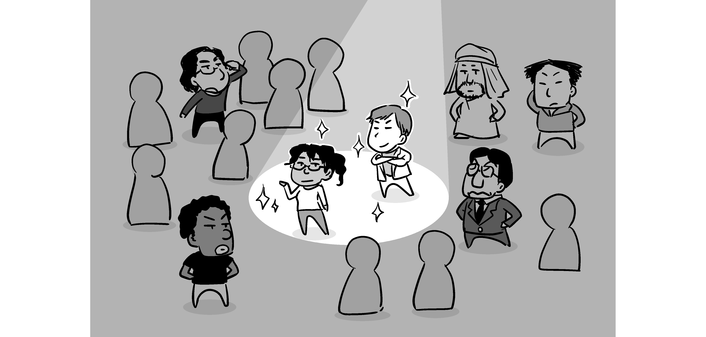

# 本当に「誰でもできる」の？

## どんな人ならOSSに関われる？

### どんな人が実際に関わってるの？

「OSS開発者」や「OSSコントリビューター」と聞いて、皆さんはどんなイメージを持つでしょうか？

* 世界を相手に実力一本で渡り合う凄腕の、いわゆる*「つよいエンジニア」*
* 難しい英語で丁々発止の議論のできるマルチリンガル
* お客さんからの無茶振りに悩まされるなんて苦労とは無縁
* 自宅やカフェからMacBookで悠々自適のリモートワーク
* 転職市場では引く手あまたでオファー殺到

2019年8月には、とある日本人が個人で開発したOSSがイスラエルのセキュリティ企業の目に留まり、買収された上で作者自身もその専任担当者として雇用されるに至った[^trivy]、という話が話題になりました。

[^trivy]: オープンソース界隈を震撼させた、Trivy買収の舞台裏 〜 オープンソースを成功させるためにできること〜｜OPENSOURCE.TOKYO https://opensource.tokyo/n/nc96669b27365

そこまで劇的でなくとも、OSSプロジェクトでの活動がきっかけとなって有名企業に転職された方は筆者の周囲にも何人もいますし、最近では「GitHub上での活動を実績のアピールに繋げよう」という打ち出し方をしている[Findyという転職サービス](https://findy-code.io/)まであったりします。

こういった話を聞けば聞くほど、「OSSを使うだけの名もないエンジニア」の自分には無縁の、遠くかけ離れた世界、雲の上の憧れの世界だ。そんな風に思ってしまう人もいるんじゃないでしょうか。

　

安心してください。実際の所、OSS開発者・コントリビューターのみんながみんなそういう生き方をしているわけではありません。*大多数の人はむしろ「どこにでもいるような普通の人達」です*。

SI業界で働きながらOSSに関わっている人もいれば、Webサービスやソフトウェア開発とは無縁の業界にいながら趣味でやっているという人もいます。かくいう筆者も、従業員10人未満の零細企業に所属して、毎朝雑居ビルの一室にある事務所に出勤しWindows PCに電源を入れ、お客さんからの問い合わせメールに回答しつつアサインされた案件の開発をこなし、夜になったら帰宅するという、ごく普通のサラリーマン生活を送っている「OSS開発者」の一人です。

ただ、働き方や仕事の内容・ライフスタイルなどは様々でも、OSSに関わる人には共通する「すごさ」があると筆者は考えています。それは、*問題の根本的な解決を図りたいと思っていて、そしてその想いを実現するために行動している*、という点です。

### 僕たちは根本的な解決を図りたい

OSSを使っていて問題に遭遇したとき、「不具合に遭遇した……どうやって回避しよう」と思う人は少なくないでしょう。

でも、ちょっと待ってください。*回避策とは本来、問題を根本的には解決できないという時にとる次善の策のはずです*。根本的な解決を取れるなら、そうするに越したことは無いですよね。

真っ先に回避策を採りたくなるのには、色々な理由があると思います。

* 未知のことに挑戦するのが恐ろしい。
* 納期が厳しいのに、失敗したら時間を無駄にしてしまう。
* 素人が関わると逆に迷惑をかけてしまう気がする。
* プロの仕事に文句を付けるなんて失礼な気がする。
* 問題の解決はプロジェクトオーナーの責任だと思う。

突き詰めて考えると、これらのためらいの根っこには、*自分がそこに関わってよいと思っていない*という認識があるのではないでしょうか。

少なくとも筆者はそうでした。自分はただのユーザーで、そのOSSを作っているのはすごい人達。ユーザーの自分は使うだけで、直すのはOSSを作っているすごい人達のすること。ユーザーに過ぎない自分には、すごい人達のようなことはできない。無意識のうちにそう考えていました。

　

ですが、先に述べたとおり、今OSSの開発に関わっている人達も多くは「普通の人達」です。しかも、OSSは多くのプロプライエタリ[^proprietary]な製品とは違ってソースコードが手に入ります。さらに、「フィードバックはこちらへどうぞ」と案内してすらいますので、「文句を言ったら失礼かも……」などと忖度する必要もありません。*必要な物は揃っていますし、許可だってしてくれている*のですから、自分にも、あなたにも、やってやれないということは無いはずです。

[^proprietary]: 「proprietary」とは「占有権のある」という意味で、「誰でも自由に使えて改変もできる物」と対置して使われる形容詞です。ソフトウェアの場合、DRMのような技術的手段や、エンドユーザーライセンスの条件のような法的手段によって、改変・再利用を禁止している物を「プロプライエタリソフトウェア」と呼びます。

そこで勇気を持って、そのOSS自体を修正して成果を還元したり、情報を提供したり、といった行動を取ること。それが「OSSへのフィードバック」の実態です。*問題を根本的に解決するために最適な行動を取ったら、結果としてOSSへのフィードバックとなっていた*という、ただそれだけのことなのです。

大丈夫、有用なフィードバックを行うための能力は後から付いてきます。必要なのは、最初の一歩を踏み出そうという思い切りだけです。

## OSSにフィードバックすると何が嬉しいの？

### 実利的なメリットもたくさんある

理想論には興味がない、現実的なことにだけ関心がある、という方もいらっしゃるでしょう。

本書は基本的に、「OSSにフィードバックしてみたい」という動機をすでに持っている方を想定して書かれています。しかし、「会社で奨励されているのでとりあえずやってみようとしている」というようなケースでは、それほど強い動機が無いという場合もあります。そういう方のために、*「問題が解決される」ということ以外の、OSSにフィードバックすることのメリット*を改めて列挙してみます。

　

個人としてOSSに関わることのメリットで、まず一番分かりやすいのは、*「すごい人だ」と思ってもらえる*という点でしょうか。

実際にやったフィードバックの内容はそれほど高度でないとしても、「OSS開発者」「OSS開発に関わった」というだけで「よく分からんが、何だかすごそうだ」と思ってくれる人はまだまだいらっしゃるようです。ハッタリだとしても、それが仕事を任されるきっかけになることもあれば、自分自身にとっても*新しいことに挑戦する自信*になるでしょう。

……というのは半分くらい冗談ですが、*「ちゃんと技術が分かる人」「優秀なITエンジニア」からの信用を得やすい*ということは実際あります。

実績が見えないのに何故かITイベントでの登壇が多い有名な人を揶揄する「IT芸人」なんて言い方がありますが、OSSにフィードバックしたという事実は間違いなく「目に見える実績」ですし、その内容からは後述するような様々な情報を読み取れます。*「この人は口先だけじゃない」と信用してもらえる材料*を積み重ねる手段として、OSSへのフィードバックは非常に有効です。

　

口先だけではない実力とはどういうものを言うか。たとえば、OSSへのフィードバックを重ねると、*仕事の上で必要になる技能と共通の技能*が身に着きます。「修正作業の中でプログラミング・コーディングの技術力」は勿論のこと、単に障害を報告するだけでも「伝わりやすい報告の書き方」「問題の再現手順を絞り込むための切り分け・調査能力」「要望する変更の必要性を説明する力」「判断材料を示して相手を説得する交渉力」など、IT業界で必要となる対人コミュニケーションの様々なスキルが磨かれます。

そうしてOSS開発の世界で実績を積み上げていると、それを見て声をかけてくれる人が現れることもあります[^referral]。いわゆる「リファラル採用」というやつですね。

[^referral]: よほど目立った実績がある場合には「うちに来てほしい」と企業側から勧誘される場合もあるようですが、そうでないなら、「ただいま求職中です」のような声を上げたときに声をかけてもらえるといった温度感のようです。まだそれほど実績がないのに転職エージェントから声がかかるケースは、あまり実績を見ずに声をかけていることがあるので、浮かれすぎないように注意しましょう……

　

問題の解消に取り組むことは、*未知の・新しいことに挑戦するきっかけ*にもなります。筆者自身、自分がユーザーとしてOSSを使っていて障害に悩まされた場面で、どうしてもその障害を解消しないといけなかったため、そのOSSの問題箇所を調べて修正することを試みて、その中で今まで避けていた言語やライブラリの使い方を習得した、ということが何度かあります。

業務では触ることが無い技術に触れる機会にもなるので、会社で言われた仕事をしているだけよりも幅広い知識が身に付いて成長できると言えるでしょう。

別の角度から見ると、*たくさんフィードバックの機会があるということが、自身の挑戦の多さのバロメーターになる*とも言えます。

一般に、OSSは新しい物・まだあまり多くの人に使われていない物ほど、機能が不足していがちで、未修正の不具合が残っていがち、ドキュメントの整備も後回しになっていがちです。そういう物を使おうとすると何をしてもつまずくため、それらの問題を解決して回るために必然的にフィードバックの機会が増えます。筆者は、フィードバックを長い間していないと「ああ、最近全然新しいことやってないんだなあ」「知ってることの範囲でだけ作業してるなあ」と自分自身の停滞に間接的に気付かされる感覚があります。

他の人の後追いばかりしていたり、すでに整備された道だけを進んでいたりすると、つまずいてフィードバックするという機会が訪れにくいです。勇気を出して、他の人がまだしていないことにぜひとも挑戦してみてください。

### 現実の問題を解決できることを楽しもう

OSSへのフィードバックの実利的なメリットを色々と挙げてみたのですが、しかしながら、それらはあくまで副次的なものに過ぎない、というのが筆者の考えです。

これらだけがすべての価値だと考えてしまうと、「目立つ大きなプロジェクトでなければ、関わる意味がない」「目立つ大きなプロジェクトに関われないのでは、やる意味がない」ということになってしまい、最初の一歩を踏み出せなくなってしまいます。

そうではなく、OSSにフィードバックすることで得られる本質的な価値は、*些細な物から大きな物まで、さまざまな現実の問題の解決に関われること*そのものだと、筆者は考えています。

成熟して完成度が高まり分業化が進んだ社会では、自分に任せられた職務の範囲のことしかさせてもらえず、その範囲を逸脱すると「余計な口出しをするな」「自分のことだけやれ」と咎められてしまう、ということが多いのではないでしょうか。

立場の垣根を越えて、問題に気が付いた人が、普段の職務の範囲を超えて問題の解決に取り組むことができる。越境して解決してくれる人の登場が望まれる。バザール方式[^bazaar]のOSSプロジェクトは、そういう場だと言えます。

[^bazaar]: エリック・レイモンド著「伽藍とバザール」（ https://cruel.org/freeware/cathedral.html ）で名付けられた概念で、個人商店が集まって形成される市場（いちば）のように、大勢の人が勝手気儘にソフトウェア開発に参加する開発スタイルのこと。この反対にある、伽藍などの大規模建造物の建築計画のように、スケジュールを切って開発を進める従来型の開発スタイルのことを、同書では「伽藍方式」と称しています。なお、OSSプロジェクトであるかどうかとバザール方式かどうかは無関係であることに注意が必要です。本書の内容は、バザール方式のOSSプロジェクトへフィードバックする場面を想定して書かれています。

　

何かの行動を継続するには、それに対する報酬が細かくあった方がいい、という話があります。ゲームでは「アイテムを手に入れた」「レベルが上がった」といった報酬が適宜示されるようになっていて、現実ではそんな報酬は滅多にないから、人はゲームにのめり込んでしまうのが当たり前なんだ、という話を聞いたことがあります。

OSSへのフィードバックも、それに似ているかもしれません。問題が解決されれば「この問題は解決済み」「このプルリクエストはマージ済み」と印が付く、そういう「実績」を日々得たくて*自分のために*関わる。そういう関わり方でも全然いいんです。

## 「つよいエンジニア」になるために本当に必要なもの

### 遭遇した問題に立ち向かう、最初の一人になろう

OSSへのフィードバックは誰でも挑戦できるということ、やると様々なメリットがあるということを、ここまでで述べてきました。改めて語られなくても、そんなこと当然知ってるよ！　それができれば苦労は無いんだよ！　という話ばかりだったかもしれません。

多くの人は、未知のことに対して「やらない理由」「自分が動かないで済む理由」を探すのに長けているものです。それは半ば本能的なもので、筆者自身も強く意識し続けていなければついついそちらに流れてしまうという自覚があります。

とある技術イベントの基調講演では、「何年間も解決されてこなかった問題を解決するために本当に必要だったのは、知識や技術力ではなく、*問題に向き合うことだった*」と話が結ばれていました[^php-kansai-2016]。

[^php-kansai-2016]: PHPカンファレンス関西2016で基調講演してきました - Mercari Engineering Blog https://tech.mercari.com/entry/2016/07/20/160602

世界を少しでも良い方向に変えるために、問題から逃げずに立ち向かうこと。問題を根本的な所で解決したいと思い、実際に解決まで導くこと。意志の力でそのような選択ができること。それが希有なことだからこそ、OSS開発者・コントリビューターは尊敬される。「つよいエンジニア」とはそういう人のことを言うのではないかと筆者は考えています。

### 問題への立ち向かい方を知ろう

とはいうものの、何の準備も後ろ盾もなく完全な手探りで問題に立ち向かうのはあまり現実的ではないです。時間をもてあましているなら色々がむしゃらに挑戦してみるのも学びが多くていいと思うのですが、現代人は忙しいので、なかなかそういうわけにもいきません。

そういうわけで、*「すでに問題に立ち向かっている人達」のやり方を真似て実践してみよう*、というのが本書の趣旨となります。

どんなOSSプロジェクトにどんなフィードバックをしたいかは人によって異なります。開発言語も開発スタイルもプロジェクトごとに全く異なるでしょう。また、「はじめに」で紹介したOSS Gateワークショップに参加された方の多くは、純粋に技術的な知識は充分にあるのに対人コミュニケーションの面での不安がネックになっているという様子でした。

なので以降の章では、具体的なコーディングのような部分にまで踏み込んでの解説はなるべくせずに、それ以外の「*OSSプロジェクトの開発者の人達とのコミュニケーションの取り方*」「*どんなOSSでも一般的に言えること*」に焦点を当てて語るようにしています。また、基本的には執筆時点での情勢に合わせてはいるものの、本質的には時代の変化・道具の変化に左右されない内容となっているのではないかと思います。

　

彼を知り己を知れば百戦あや<!-- 殆 -->うからず。それでは、ここから先は日々OSS開発に関わっている人達の目線になって、OSSへのコントリビューション、特にフィードバックの仕方の実際のところを見ていきましょう。
