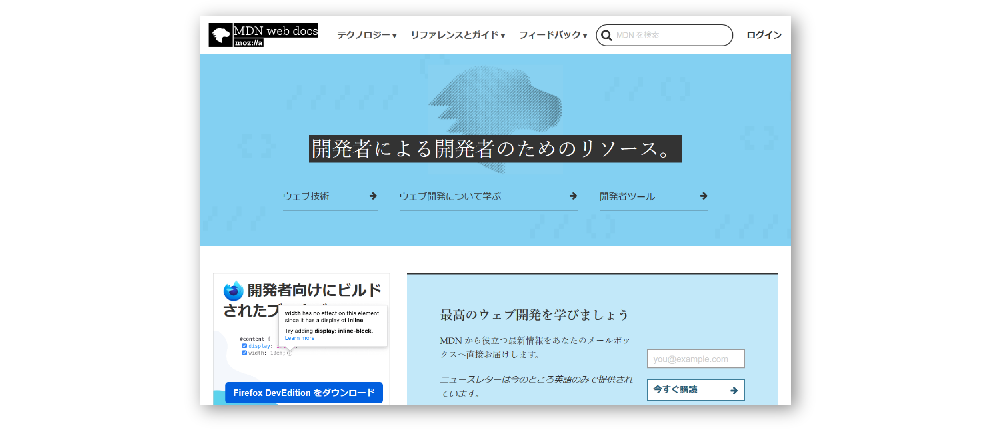

# バグ報告やパッチ提供以外の形でのOSS開発への参加

ここまで、イシュー報告とプルリクエストに焦点を当てて、OSSへのフィードバックの仕方を色々と解説してきました。

ですが、OSSへは他にも色々な関わり方があります。本章では周辺情報として、それらも併せて簡単にご紹介しておきます。

## 翻訳への参加

### 未訳を見つけたらフィードバックのチャンス

OSSを使っていて、UIがまるっきり英語だったり、あるいは、ほとんどの部分は日本語化されているのに一部の項目だけ英語だったり、という状況に遭遇したら、翻訳に参加するチャンスです。

GUIを持つOSSの多くは英語を基本の表示言語にしていて、それ以外の各言語への翻訳（ローカライズ）は、その言語を母語とする人による協力頼みとなっています。善意の協力者の人が翻訳してくれても、その人が何らかのなんだかの事情で活動できなくなってしまうと、追加された機能や変更された機能の部分が未訳のまま取り残されてしまう、ということはよくあります。

小規模なOSSプロジェクトでは、翻訳はフィードバックの種類の中でもハードルが低い方だと言えます。ロジックに対する変更のプルリクエストでは、プロジェクトの方針に則っているかのレビューがあるのに対し、*翻訳リソースに対するプルリクエストは、大抵は作者がその翻訳の内容を理解できないので、ほぼノーチェックの素通しとなることが多い*からです。

### 翻訳用システムを使った翻訳

ただ、プロジェクトによっては、複数人で一つの言語のリソースを分担して翻訳するために、「翻訳用のシステム」を使っている場合があります。

たとえば、ownCloudやその派生のNextcloudが使っている[Transifex](https://www.transifex.com/)というサービスでは、既訳・未訳部分の管理や、訳語の統一[^unify-translated-term]のための辞書機能、翻訳結果の相互レビューなど、各人が作業に集中しつつ翻訳の品質を高めるための機能を提供しています。

[^unify-translated-term]: 「Tracking Protection」という表現を「トラッキング保護」と訳すか「行動履歴の追跡からの保護」と訳すか、というように、訳し方の判断が翻訳者によってぶれないようにすること。

同様のサービスは[Crowdin](https://crowdin.com/)、[GitLocalize](https://gitlocalize.com/)、[BabelZilla](https://www.babelzilla.org/)などいくつかあります。リポジトリ管理におけるGitHubほどには「デファクトスタンダード」と言える一人勝ちのプレイヤーは決まっていない様子で、それぞれサービスごとの使い勝手の差異も大きいため、本書ではいずれかのサービスの具体的な使い方を詳述するということはしないことにします。

翻訳作業への協力の仕方は、そのOSSプロジェクトへの参加方法の案内の中に「翻訳（localize）に参加したい場合はこちらから」のように記載されていたり、あるいは、コミュニティ紹介の中で「開発者コミュニティ（Developers Community）」とは別に「翻訳コミュニティ（Translation Community）」として紹介されていたりします。案内が見つからない場合、とりあえずリポジトリに普通にプルリクエストの形で言語リソースの修正を提案した上で、「翻訳に協力する差異のルールを教えて欲しい」のように質問すれば、適切な情報に誘導してもらえるでしょう。

### 機械翻訳の結果は使わない方が安全

英語の書き方の話でも同様のことを述べましたが、元の英語リソースの内容をGoogle翻訳などの機械翻訳にかけた結果を、そのまま翻訳作業の成果としてフィードバックするのは避けましょう。

理由の1つは、*訳文の権利の問題*です。

機械翻訳のサービスやツールによっては、結果の訳文の二次利用や商用利用を規約で禁止している場合があります。OSSは商用利用を禁止しないため、そのような禁止事項がある訳文をOSSにフィードバックしてしまうと、そのOSSプロジェクト全体が「翻訳サービスやツールの規約に違反した」ということになってしまいます。実際に、[Ubuntuコミュニティなどで、Web翻訳の結果をOSSに不用意に入れた人がいたために、その人が過去関わった全ての翻訳済みリソースについて権利面での妥当性を再確認せざるを得なくなった、という事例](https://blog.goo.ne.jp/ikunya/e/37e5a52e10ab26fcbd4f7ff867e9eace)もあります。

また、もう1つの理由として、*機械翻訳は文脈を汲み取ってはくれないという問題*もあります。

OSSのUIに登場する文は断片的なフレーズが多く、そのまま機械翻訳にかけた結果を埋め込むと、UI上で意味をなさないおかしな箇所が発生しやすいです。たとえば、Firefoxには「Reload Tab」というコマンドがありますが、Google翻訳で単に英和翻訳すると「再読み込みタブ」と訳されるため、そのままUI上に反映すると非常に違和感がある状態になってしまいます（実際の日本語版では「タブを再読み込み」と訳されています）。

## Wikiの内容のメンテナンス

### 誰でも編集できるドキュメントシステム

OSSプロジェクトでは、技術仕様をWiki形式で公開している場合があります。OSSプロジェクトによっては、いわゆる「公式サイト」が存在せず、GitHubのプロジェクトページのWikiがそれに相当する扱いになっている、ということもあります。また、そのように特定のOSSプロジェクトに付随するWikiだけでなく、Mozillaが運営するMDN Web Docs[^mdn-web-docs]のように、Webサイト全体がWikiになっていることもあります。

[^mdn-web-docs]: https://developer.mozilla.org/ 「MDN」は「Mozilla Developer Network」の略で、元々はFirefoxやThunderbirdなどMozillaプロジェクトのソフトウェアに関するさまざまな技術情報を集積する場所でした。現在は役割が拡張され、Microsoft、Googleなどの複数社が公式にメンテナンスに参加する、Web技術情報のリファレンスサイトとなっています。

日本では「Wiki形式の百科辞典（Encyclopedia）」であるWikipediaを通じてWikiという概念が知られるようになったことから、「Wikiとは百科辞典のことである」という認識のされ方をしている場合が多いようですが、*「Wiki」とは元々、不特定多数の人が自由に編集できるWeb上の文書システムを指す言葉です*。基本的にはアカウントさえ作れば誰でも編集に参加できる気軽なシステムで、いわゆる集合知によって情報が適切な状態に保たれていく、というコンセプトとなっています。

### 技術情報の間違いを見つけたら、フィードバックのチャンス

OSSでは、重要な技術情報がソースコード内に書かれている場合も多いのですが、コードの中に散らばった技術情報を探して読むのは大変です。そういった情報をドキュメントとして読みやすい形で整備するために、Wikiは使われています。

しかし、開発の中心となるソースコードとは別の所に切り離されている都合上、日々ソースコードが更新されていくのに対し、ドキュメントであるWikiは更新されないまま放置されてしまっている場合が度々あります。皆さんももしかしたら、Wikiの技術情報を見ていたら「あれ、おかしいな？　書いてあるとおりにならないぞ……？」「英語版ではこう書いてあるのに、日本語版では違う事が書かれてるぞ？　どうも、翻訳された後で元の英語版が更新されたようだ……」という場面に遭遇したことがあるのではないでしょうか。

そういう状況を発見した場合、*誰でもその場で即座に、自由に編集して修正して構いません*。「間違いを報告する、その報告の仕方」を考えるまでもなく、「この情報はこうなっているのが正しい」という状態に直すだけです。プルリクエストではプロジェクトオーナーの判断を経て初めて編集結果が公開されますが、Wikiではそのような審査はなく、編集結果が即座に公開のWebサイトに反映されます。

もし間違った内容を書いてしまっても、履歴を辿って元のバージョンに戻せますし、他の人が直してくれることもあります。「失敗」を恐れる必要はありませんので、皆さんもぜひWikiの編集に挑戦してみてください。

## いわゆる「雑用」の負担軽減

### イシューの交通整理

イシュートラッカーには日々新たな報告が行われますが、その中には、既存の報告と同じ内容の物や、ソフトウェアの問題ではなくユーザーの使い方の問題である物なども含まれています。また、「再現手順」「実際に得られた結果」「期待された結果」という基本的な説明が欠けていたり、あっても情報が不足していたり、ということもあります。

そういう「問題がある報告」について、適切な情報へ誘導したり、足りない情報の補足を依頼したりする、という作業は、開発者にとって地味に負担となります。個人あるいは少人数で運営されているOSSプロジェクトで、ユーザーにソフトウェア開発者でない人が多く、質が高くないフィードバックが多く寄せられている状況では、そういったイシューに応答すること自体に時間とやる気を取られてしまい、肝心の開発に支障をきたすこともあります。「こともあります」というか、*筆者が実際にそうなっています*。

そういう状況を見かねて、かねてより良質なフィードバックを寄せてくれていた人の一人が、イシューの整理役を申し出て下さったということがありました。溜まっていた未処理のイシューに対し、不足している情報の提供を呼びかけたり、重複分を誘導したり、といった作業をその人に引き取ってもらった[^issue-management]結果、未処理のイシューの相当数がクローズされ、状況は大きく改善しました。

[^issue-management]: 実際には、GitHubの仕様上、イシュートラッカーの管理権限だけを委譲するということはできないため、その人にコメントを付けて回ってもらい、そのコメントを見て筆者が機械的に処理する、という形を取っています。

ある種の性格傾向の人は、*未処理のタスクが大量に積み上がった状態だと、そのこと自体からストレスを受け、タスクの処理がさらに進まなくなる、という悪循環に陥る*ことがあるようです。もしそのような状況に陥っているOSSプロジェクトに遭遇した場合には、あなたがイシューの交通整理役を引き受けることで、開発者の負担を軽減して、開発がよりスムーズに進むことにコントリビュートできるかもしれません。

### リリース作業の分担

イシューの対応と同様に滞ってしまいがちなのが、「新バージョンのリリース」です。

OSSプロジェクトにおける「新バージョンのリリース」とは、具体的には以下のような作業の総体です。

* 後退バグが発生していないかを確認する。
* バージョン管理システムに対してタグを打つ。
* 新しいバージョンのパッケージを作成する。
* 作成したパッケージを、ダウンロード可能な状態に公開する。
* 新バージョンでの変更点の情報をまとめる。
* 新バージョンがリリースされた旨をアナウンスする。

リリース作業は回数を重ねるほどに定型的になるため、開発者にとっては、時に「面白くない作業」「雑用」となってしまいます。また、開発者は自分自身では（主にテスト目的で）最新開発版を使っていることが多いため、最新の開発の成果が常に使える状態になっています。そうすると、「新しいバージョンをリリースして、前のバージョンには無かった新機能や修正を使えるようにする」という作業は、「自分以外の人のためだけに、義務感でやる、重要性が高いけれどもモチベーションの低い作業」となり、やるのがますます億劫になってしまいます。

タグを打ったりパッケージを公開したりという特にクリティカルな工程はプロジェクトのコアメンバーがやる必要がありますが、それ以外の*情報収集や整理、リリースアナウンスの準備など*は、プロジェクト外のコントリビューターでも協力することはできます。

リリース作業の負担が減ると、*修正が行われた後の版が迅速にリリースされるようになり*、一般のユーザーにとっては嬉しい結果になります。もし開発自体は行われているのにリリースが滞りがちなOSSプロジェクトを見かけたら、リリース作業の一部でも協力できないか打診してみる価値はあるでしょう。
